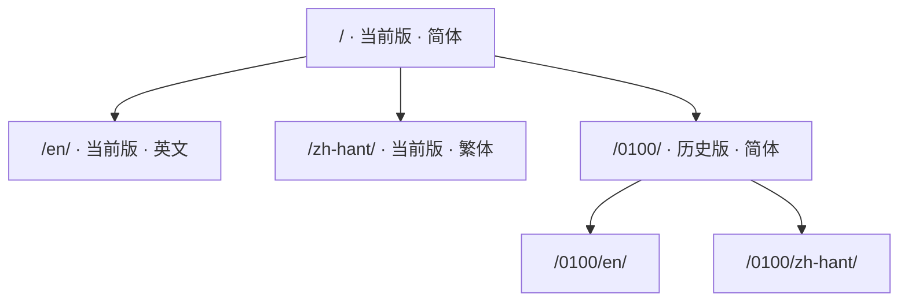

# 关于

这是一份 RWR（小兵步枪）地图编辑器的中文手册：**面板上的每一项是干什么的、
有哪些模型能摆、按键怎么按、配置文件怎么填**。写它的人是做地图的，不是官方。

|  |  |
| --- | --- |
| 地编版本 | 0101 |
| 手册编辑日期 | 20260922 |
| 当前编辑者 | HamSter |
| 清单模板版本 | vao0822 |

## 这份手册覆盖什么

| 分区 | 讲什么 |
| --- | --- |
| [准备工作](../prepare/index.md) | 拿到地编之后怎么配置、怎么与 RWR 的文件夹同步、怎么打开自带的相机 mod |
| [地编界面](../editor/index.md) | 主界面各工具逐项说明、交互按键、按 ID 找物件 |
| [模型清单](../tables/index.md) | 五张清单、七百多个物件，带预览图与备注 |
| [设置文件](../settings/index.md) | mapSettings、3rdParSettings、RefpM 三个配置文件的每一项 |

## 网址是怎么排的

版本在前、语言在后，所以同一页在不同版本、不同语言下各有各的地址：

## 哪些地方还没查证

不是每一行都试过。这些地方在页面上明确标着，读的时候请当心：

| 标记 | 意思 |
| --- | --- |
| **待试** | 整页都还没逐项验证过，比如 mapSettings 那一页 |
| **未完成** | 只写到一半，或只有一句话提及 |
| 没试 / 不知道这是啥 | 那一行作者也没验证过，**照着填可以，别当成结论** |

「据说是这样」的说法也原样留着。**这份手册不替读者作判断。**

!!! quote "为什么写得这么直"
    这些话是写给做图的人看的：「加载时崩溃」「无碰撞箱」「千万别把材质错误
    全部归类成是模板类 Mesh」。都原样留着，没有润成书面语——
    润过之后，读者反而判断不出它有多确定。
