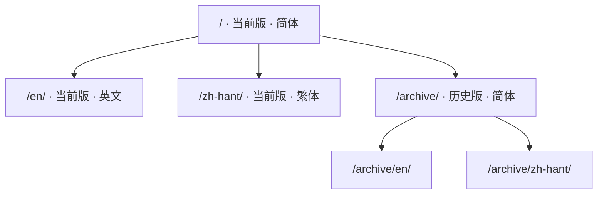

# 关于

这份手册来自 RWR 地图编辑组的内部文档《鼠书》，以及组里维护的模型清单表。

|  |  |
| --- | --- |
| 地编版本 | 0101 |
| 手册编辑日期 | 20260922 |
| 当前编辑者 | HamSter |
| 清单表模板版本 | vao0822 |

## 两份原件

| 原件 | 形态 | 变成了站上的哪一部分 |
| --- | --- | --- |
| 《鼠书》 | 单页 HTML，54 张内嵌图 | 准备工作、地编界面、设置文件 |
| 清单表 | 5 张工作表的 Excel，705 张浮动图 | 模型清单的五页 |

## 网址是怎么排的

版本在前、语言在后，所以同一页在不同版本、不同语言下各有各的地址：

## 原文里还没查证的部分

原文自己标了「待试」的地方照原样留着，在导航里挂一枚「未完成」的标记；
那些「据说是这样」的说法也一个字没改。**这份搬运不替原文作判断。**

!!! quote "原文的语气"
    组里写这份东西是给自己人看的，所以写得直：「加载时崩溃」「无碰撞箱」
    「千万别把材质错误全部归类成是模板类 Mesh」。这些话都原样留着，
    没有润成书面语——润过之后，读者反而判断不出它有多确定。
