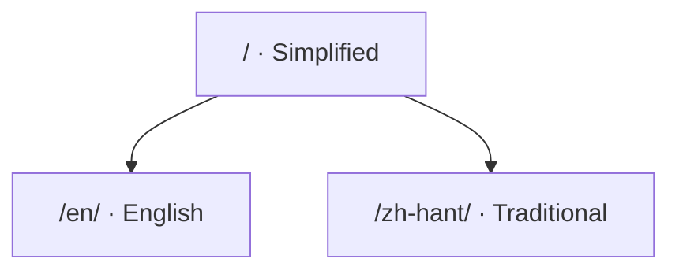

# About

This is a handbook for the Running With Rifles map editor: **what every panel does, which
models you can place, which key does what, and how to fill in the configuration files**.
It was written by people who make maps, not by the developers.

|  |  |
| --- | --- |
| Editor version | 0101 |
| Handbook edited | 20260922 |
| Current editor | HamSter |
| Inventory template version | vao0822 |

## What this handbook covers

| Section | What is in it |
| --- | --- |
| [Getting ready](../prepare/index.md) | How to configure the editor once you have it, how to sync it with your RWR folder, and how to switch on the built-in camera mod |
| [The editor](../editor/index.md) | Every tool on the main panel, the key bindings, and finding an object by ID |
| [Model inventories](../tables/index.md) | Five inventories, seven hundred objects, with previews and notes |
| [Configuration files](../settings/index.md) | Every entry in mapSettings, 3rdParSettings and RefpM |

## How the URLs are laid out

Language is the only prefix, and the default language has none. The same page has its
own address in each of the three languages:

## What has not been verified

Not every line has been tried. Where that is the case, the page says so — read with care:

| Marker | What it means |
| --- | --- |
| **Untested** | the whole page has not been checked item by item |
| **Incomplete** | written only halfway, or mentioned in a single sentence |
| not tried / no idea what this is | the author did not verify that row either — **fill it in as shown, but do not treat it as a conclusion** |

The "it is said that…" passages are kept as written too.
**This handbook does not second-guess the source.**

!!! quote "Why it reads so bluntly"
    These notes were written for people who actually build maps: "crashes on load",
    "no collision box", "whatever you do, do not file every material error under
    template meshes". All of it is kept as written, not polished into formal prose —
    polished, a reader could no longer tell how certain the author was.
