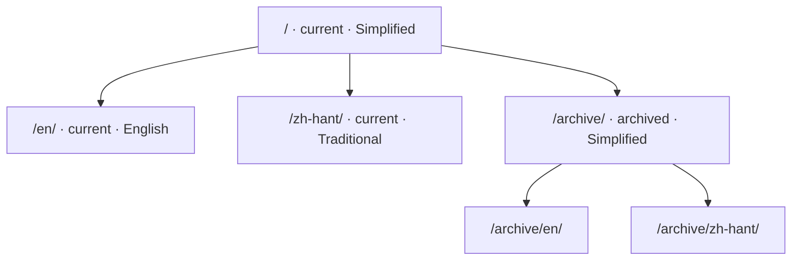

# About

This handbook comes from *Rat Book*, the RWR map-editing group's internal document,
together with the model inventories the group maintains.

|  |  |
| --- | --- |
| Editor version | 0101 |
| Handbook edited | 20260922 |
| Current editor | HamSter |
| Inventory template version | vao0822 |

## The two originals

| Original | Form | What it became on this site |
| --- | --- | --- |
| *Rat Book* | a single HTML page with 54 embedded images | Getting ready, The editor, Configuration files |
| The inventories | an Excel workbook, 5 sheets, 705 floating images | The five pages of Model inventories |

## How the URLs are laid out

Version first, language second — so the same page has its own address in every version
and every language:

## What the original left unverified

Where the original says "untested", it still does, and the navigation shows an
*Incomplete* marker for it; the "it is said that…" passages are unchanged too.
**This move does not second-guess the source.**

!!! quote "How the original sounds"
    These notes were written by the group for the group, so they are blunt:
    "crashes on load", "no collision box", "whatever you do, do not file every material
    error under template meshes". All of that is kept as written — polished into formal
    prose, a reader could no longer tell how certain the author was.
