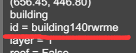
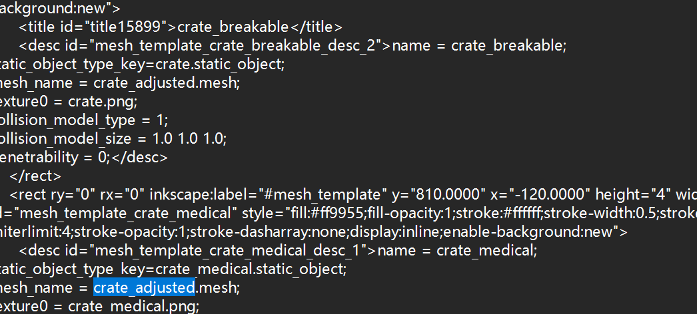

# ID search { #id-search }

EDITOR · what that number in the error is

An editor error usually throws an ID at you. With that ID you can find the matching
object on the map — this is the trick you will use most when fixing a map.

1. First read the ID in the error message (or look at where the ID appears in the
   "finding problems" images below).

    

2. Put the ID into the search box and search.

    

## Some uses for finding problems

The images below are examples; in each one you get the ID first, then go back to the map
to locate it:

!!! tip "IDs change"
    The editor re-numbers every ID each time it saves, so the number may differ from the
    last one. So **what you wrote down is this moment's ID**; save once and search again,
    and it may not be it any more.
