# The main panel

EDITOR · fourteen buttons, one job each

The editor's top bar lays these tools out from left to right. Below they are taken one
by one in order — every entry is **something that came out of using it**, not something
guessed from the interface text.

-   __Save__

    ---

    Save the map

    [:octicons-arrow-right-24: Read](#save)

-   __ViewMap__

    ---

    Generate the tactical preview image

    [:octicons-arrow-right-24: Read](#viewmap)

-   __Select__

    ---

    Select, move, rotate

    [:octicons-arrow-right-24: Read](#select)

-   __PinMan__

    ---

    Place reference objects

    [:octicons-arrow-right-24: Read](#pinman)

-   __WallE__

    ---

    Draw walls

    [:octicons-arrow-right-24: Read](#walle)

-   __BuildingE__

    ---

    Place houses

    [:octicons-arrow-right-24: Read](#buildinge)

-   __PlatformE__

    ---

    Draw platforms, change heights

    [:octicons-arrow-right-24: Read](#platforme)

-   __FuncObjects__

    ---

    Ladders, crates, spawn points, bases

    [:octicons-arrow-right-24: Read](#funcobjects)

-   __MeshE__

    ---

    Place models, power poles

    [:octicons-arrow-right-24: Read](#meshe)

-   __HeightMap__

    ---

    Paint terrain height

    [:octicons-arrow-right-24: Read](#heightmap)

-   __TerrainBash__

    ---

    Paint ground texture

    [:octicons-arrow-right-24: Read](#terrainbash)

-   __offroadbuilder__

    ---

    Mark driving routes for the AI

    [:octicons-arrow-right-24: Read](#offroadbuilder)

-   __Decal__

    ---

    Ground decals

    [:octicons-arrow-right-24: Read](#decal)

-   __Assaum__

    ---

    Ready-made assemblies

    [:octicons-arrow-right-24: Read](#assaum)

-   __A few extra notes__

    ---

    Stacking order, ID reordering — the traps you cannot dodge

    [:octicons-arrow-right-24: Read](#extra)

-   __How do you draw a platform?__

    ---

    From high ground down a gentle slope into the water, drawn through once step by step

    [:octicons-arrow-right-24: Read](#platform)

## Save { #save }

Simply saves the map; when it is done you get a sound.

## ViewMap { #viewmap }

Generates the tactical preview image of the map — the map you look at in RWR by pressing Tab.

!!! question "Doubtful"
    You probably have to tweak the file name yourself?

## Select { #select }

- Left click to select a single object, Ctrl+left click or left-drag to select several.
- Press Esc to deselect.
- Press Delete to delete the selected target.
- Press G to switch on move mode; moving the mouse then drags the selected objects away.
- Press R to switch on rotate mode; moving the mouse then rotates the selected objects to some angle.
- In any other tool mode, the Shift+1 shortcut jumps quickly back to the Select tool.
- You cannot select several platforms at once.
- In top-down view (orthographic) some platforms will not display or select properly; you have to switch to free camera (perspective) to select them.
- Moving and rotating in free camera (perspective) is not recommended; the interaction is a bit of a pain.

## PinMan { #pinman }

Used to place a virtual reference object at the point you click.

There are three options, but only the tank works.

## WallE { #walle }

- Used to pick the kind of wall from the list, and to draw nodes with PathBush and then press space to join them into a line in placement order. You can pick the wall kind first and then draw, or draw first and then pick the wall kind — once you have picked, click the wall you already drew and the replacement is done.
- The search bar finds an object quickly by name, and for what each wall does see [Model inventories · Wall E](../tables/wall.md).
- With it selected by Select, you can edit the coordinates on this panel (the first field grows along X to the right, the second grows along Y downwards; the values are twice the coordinates of the current mouse position), use Add Point to add a connected segment in the drawing direction, and use the cross to delete that node.
- With several selected by Select, you can delete the specified objects on this panel; the same goes for Buiding, Mesh and the rest.
- With it selected by Select, you can see the id, the current layer and the wall kind on this panel, and set a custom height and whether to Merge.
- Marge is ticked by default, to stop the AI getting stuck on the wall and failing to climb over it.
- With ReHeight ticked you can type in the wall's height yourself.

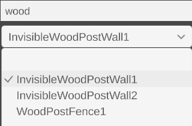

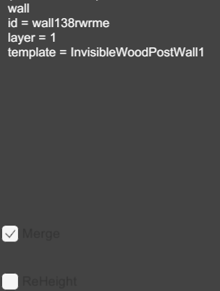

## BuildingE { #buildinge }

- Used to pick the kind of building from the list, and to draw buildings with DrawBush by holding the left button and dragging. You can pick the building kind first and then draw, or draw first and then pick the building kind — once you have picked, click the building you already drew and the replacement is done.
- The search bar finds an object quickly by name, and for what each building looks like see [Model inventories · Building E](../tables/building.md).
- At the very top, HeightDown and HeightUp change the height of the Building at the clicked spot, by 2 each time (6).
- RoofSwitch turns the roof into a pitched/flat roof; the pitched direction is fixed, so you have to select the building and press R to rotate it yourself.
- It is best to finish adjusting Height first and then stack new objects on top: the height of the objects above does not follow changes in the height of the Building below.
- With it selected by Select, you can see the id, the current layer, whether the roof is pitched and the building kind on this panel.
- Offset sets a custom offset (the first field grows along X to the right, the second grows along Z towards the top, the third grows along Y downwards).
- Right now the X axis cannot be changed.

!!! warning "Needs fixing"
    In free camera (perspective), the perspective has serious problems depending on the direction; see the example image on the right above.

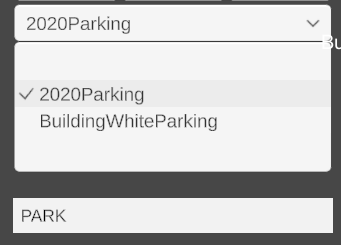

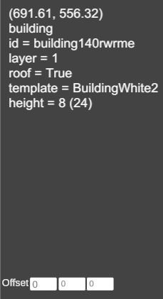

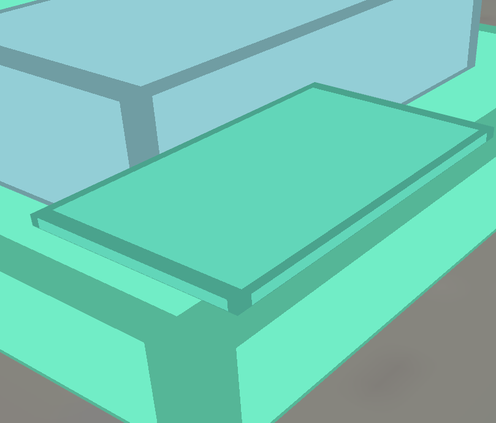

## PlatformE { #platforme }

- Used to pick the kind of platform from the list and draw with pathBush; like Wall, so no more detail here.
- For a worked example see below: How do you draw a platform?
- The search bar is like Wall's, so no more detail here.
- At the very bottom, TypeChange switches the Platform at the clicked spot between no special property, the deck property and the bridge property. (This section is not finished yet.)
- ChangeHei works by setting the height and then pressing Enter to put the tool into use; it changes the height of the Platform at the clicked spot.
- With it selected by Select, you can edit the coordinates on this panel; the method is like Wall's, so no more detail here.
- With it selected by Select, you can see the type, id, current layer, top material, the kind of wall on the platform's sides, the kind of wall added on top of the platform and the wall height on this panel.
- The kind of wall added on top of the platform can be changed with the WallE tool.
- The value added in SetMaterial can be wood, grass, pavement, terrian. (This section is not finished yet.)

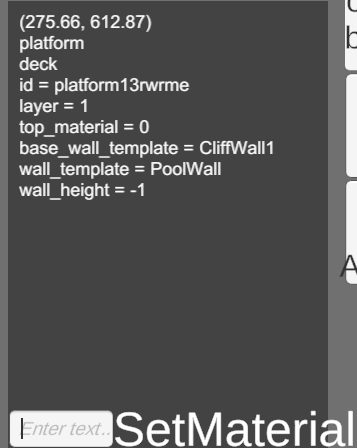

## FuncObjects { #funcobjects }

LadderScatter and LadderEraser place ladders and delete ladders. A placed ladder snaps
automatically to nearby buildings, platforms and anything else with fixed collision.

!!! warning "Needs optimisation"
    Right now the snapping is about as well-behaved as a cat, and there are problems.

- ItemSupplyScatter places the trigger area of a stash or an armory: stash is the stash, weapon_rack is the armory; once selected, click ChangeType below to switch.
- CrateScatter and CrateEraser place wooden crates and delete wooden crates; the items inside are random and cannot be specified.
- SpawnScatter and SpawnEraser create spawn points and delete spawn points; a spawn point should not sit too close to the map edge.
- BaseScatter creates a base by left-dragging. With it selected by Select, you can change the base's displayed name and specify which faction captured this base first; fill in 0, 1 or 2 — which one is which I honestly do not know either haha XD

## MeshE { #meshe }

- Used to pick the kind of model from the list.
- The search bar is like Wall's, so no more detail here.
- StoneEraser and StoneScatter delete a random rock or place a random rock; for what the rocks look like see [Model inventories · MESH E](../tables/mesh.md).
- TreeEraser and TreeScatter delete a random tree or place a random tree; for what the trees look like see [Model inventories · MESH E](../tables/mesh.md).
- The tool at the very bottom is used like Wall: it places power poles as nodes, and once they are placed you press space to run wires in order between each pair — the wires are decoration only, with no collision.
- With it selected by Select, you can see the id, the kind and the collision box on this panel (not shown if it is the default).
- With ReCollision ticked you can change length, height and width in the window above (measured from the centre).
- offset sets a custom offset (the first field grows along X to the right, the second grows along Z towards the top, the third grows along Y downwards).

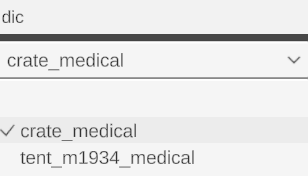

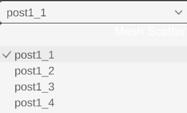

## HeightMap { #heightmap }

- HeightBush is the terrain brush. In the panel at the bottom left, SetHardness is the hardness, which decides how steep the transition is between the height you are painting and the background height, range 0 to 1; SerRange is the terrain brush's range; SetHeight is the terrain brush's height, range 0 to 1. Press X to lock the brush horizontally, Y to lock it vertically.
- HeightSmudge drags the height within a certain range under the mouse and, following the direction the mouse moves, makes the nearby terrain deform as a transition.
- Smooth flattens the terrain over the whole map.
- Noise adds noise to the terrain over the whole map, so that the map is not a big flat plain at a single height value but has some tiny bumps.
- heightPath is the path terrain brush; it is used like the Wall tool, the top left explains the relevant values and you can try it yourself.

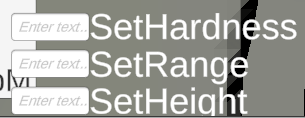

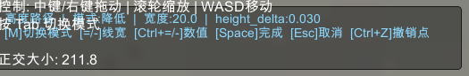

## TerrainBash { #terrainbash }

- Pathpainter is the path ground-texture brush; it is used like the Wall tool, the top left explains the relevant values and you can try it yourself.
- The decay exponent is adjusted with [ and ], it is not a description typed twice that turned into [[/]].
- painter is the ground-texture brush: Chg Index is the material kind, a number; Chg Rng is the range; Chg Har is the hardness.
- In version 0101, when you use this tool there may be a spare adjustment bar in the bottom left; it does nothing at all.
- Smooth flattens the ground texture over the whole map.

## offroadbuilder { #offroadbuilder }

Used to tell the AI that this route is a driving route, so it can let loose behind the wheel.

It is used like the Wall tool.

## Decal { #decal }

- Used to pick the kind of decal from the list; you can think of it as printing another layer of material on top of the ground texture. Once picked, left click to place it.
- deleteDecals deletes the decals inside the marquee you drag.
- Once Select has picked it, you can use Length to change this decal's size, that is its scale.

## Assaum { #assaum }

Used to pick assemblies from the list, an armory with its collision box and trigger area already built for example. Once picked, left click to place it.

Add and Name are unavailable for now, with no effect.

## A few extra notes { #extra }

1. If you want to put a Wall, Building, Platform or the like on top of a Building, then once you have thought it through you should draw from the bottom up; when drawing you have to make sure the start point is inside the previous element. That way all the objects stack one by one as layer1, layer2…, pick up the height of the previous one automatically, and climbing and other checks work properly too.

2. Every time the editor saves it re-sorts the IDs, so the numbers may change.

## How do you draw a platform? { #platform }

Take a transition cliff platform as the example:

This time we want to get from the high ground on the left down a gentle slope into the water at the bottom of the valley. You can see that to the left of the arrow direction there is a slope that is not all that gentle, and to the right a sheer cliff, so we should make a transition cliff taking the height of the slope on the left as the baseline.

Because when drawing a platform you have to make sure the end edge is to the right of the direction the start edge travels in, and the start edge is the edge that decides the height, we should first draw on the gentle slope to the left of the arrow, following the arrow direction of figure 1.

(Eight points were drawn; if you want the change to be more even you can place a few more.) Then press space, place the other corresponding eight points to the right of the arrow, and press space a second time to finish drawing.

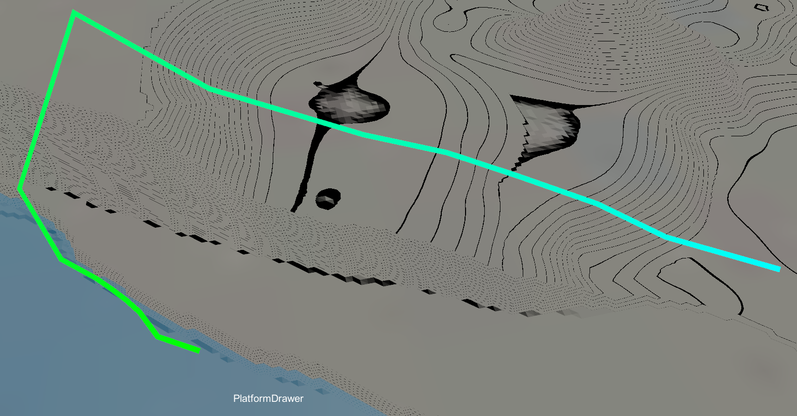

Then fine-tune the platform to make it reasonable.

(The blue points are the reference points, that is the points generated by the first line drawn; the line between a blue point and a pink point is the terrain's transition.)

(If your platform is that purple-and-black broken render colour, then congratulations, you placed it the wrong way round — please note once more that when drawing a platform you have to make sure the end edge is to the right of the direction the start edge travels in.)

(The images are not compressed anyway, so zoom in and look at the details yourself.)

Let's go look in game~

Sure enough it came out a total mess — which shows how important it is to add a few more anchors and polish the terrain. Let this be a warning to you all :(

