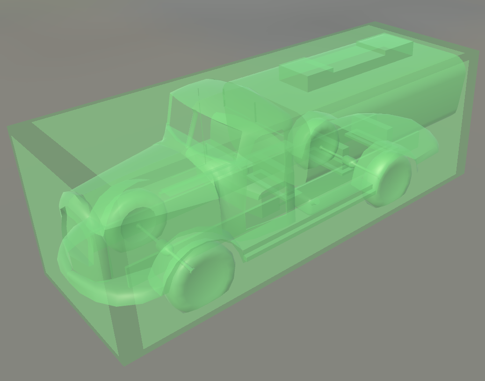

# 3rdParSettings { #third-party }

<p class="kicker">SETTINGS · optional, but clearly better with it</p>

!!! info "You can skip this step"
    Without it the editor works just the same, it only shows models and materials more coarsely.
    Setting it up means downloading [OgreSDK](../download/index.md#materials) first.

Three paths have to be set; miss one and the matching resources will not load.

## 1. Choosing the OgreXMLConverter.exe Path { #ogreref }

1. Click Select, check where `OgreSDK_vc10_v1-7-4.zip` was unzipped, and find its root folder.
2. Follow `OgreSDK_vc10_v1-7-4\bin\release` down to `OgreXMLConverter.exe` and pick it.
3. That is the first configuration done — on to steps two and three.

!!! example "Example paths, for reference only"
    ```text
    D:\RWRMap\OgreSDK_vc10_v1-7-4\bin\release
    ```

## 2. Choosing the Mesh files path { #mesh-path }

1. Find the root folder of Running With Rifles in your Steam library. You can get there in the
   Steam client via Manage → Browse local files.

    

2. Follow `RunningWithRifles\media\packages\vanilla` down to the `models` folder and pick it.
3. Click **load mesh**.

!!! example "Example paths, for reference only"
    ```text
    D:\steam\steamapps\common\RunningWithRifles\media\packages\vanilla
    ```

Once it is set, the result looks like this (a Mesh, as an example):



/// caption
Models are no longer boxes; you can see their real shape.
///

## 3. Choosing the textures path { #textures-path }

1. The same as step 1 of the section before.
2. Follow `RunningWithRifles\media\packages\vanilla` down to the `textures` folder and pick it.
3. Click **load textures**.

!!! example "Example paths, for reference only"
    ```text
    D:\steam\steamapps\common\RunningWithRifles\media\packages\vanilla
    ```

Once it is set, the result looks like this (a Decal, as an example):


/// caption
Ground decals now have their real materials.
///
