# Decal { #decal }

EDITOR · ground decals

!!! tip "How to read this table"
    The **Preview** column gives two images side by side: the left one looks down at an
    oblique angle, the right one faces the normal directly. Judge the shape by the
    **horizontal** line; the vertical one is in perspective.

    One table. The Notes column says whether the texture reference has any problems.

*[template]: the name an object is referred to by in `template = …`; that is how you look it up

| Preview | Name | Notes |
| --- | --- | --- |
| 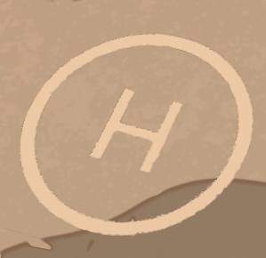 | Helipad template = heliped |  |
| 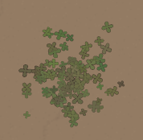 | Clover lawn template = clover |  |
|  | Pavement template = pavement |  |
| 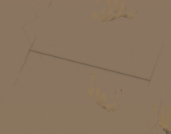 | Flower template = flower | Same as the one above; this texture reference has a bug |
| 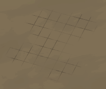 | Pavement template = pavement_tile1 | Square brick texture |
| 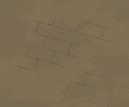 | Roof template = roof_tile1 | Rectangular brick texture |
| 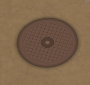 | Manhole template = manhole |  |
| 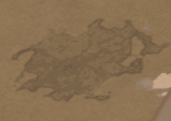 | Cracks template = cracks_1 |  |
| 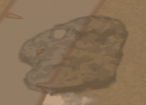 | Cracks template = cracks_2 |  |
| 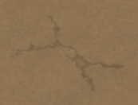 | Cracks template = cracks_3 |  |
| 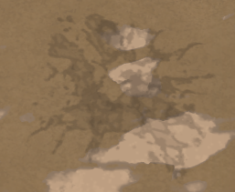 | Cracks template = cracks_4 |  |
| 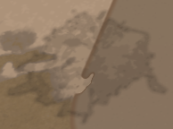 | Cracks template = cracks_5 |  |
| 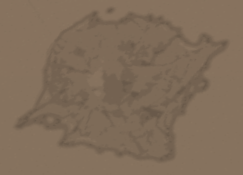 | Cracks template = cracks_6 |  |
| 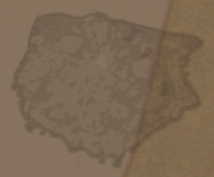 | Cracks template = cracks_7 |  |
| 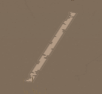 | Parking line template = parking_line |  |
| 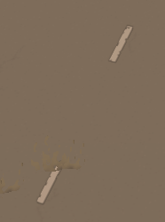 | Road line template = roadline |  |
| 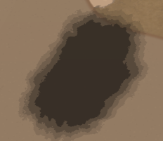 | Burned ground template = burned_ground |  |
| 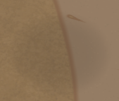 | Tree shade template = tree_ground_base1 | A faint black circle |
| 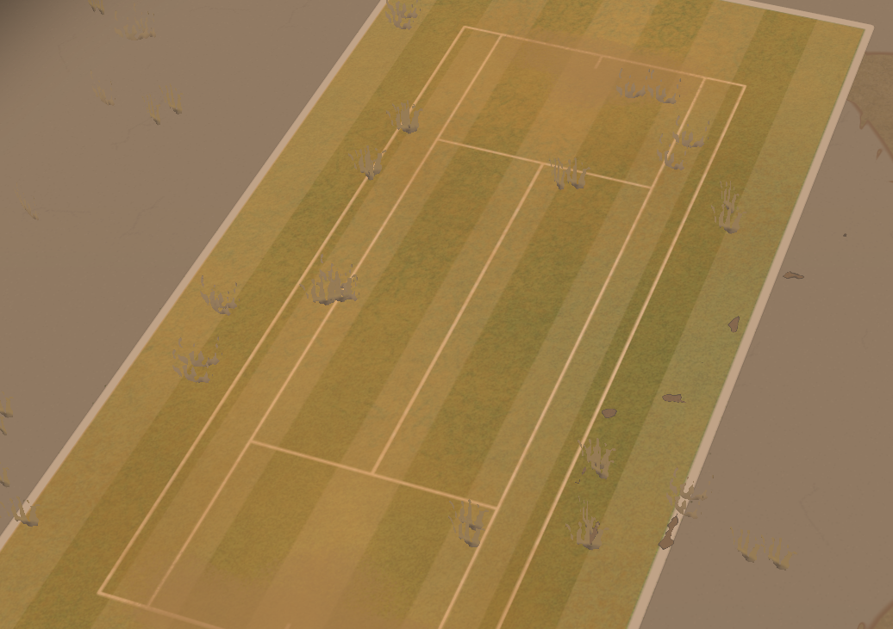 | A big patch of tennis court template = tennis_court |  |
| 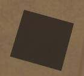 | Mysterious brown square template = ee_8 |  It is actually the KILROY WAS HERE easter-egg icon It only shows up properly if ee_8 is placed in the map file  |
