# MESH E { #mesh }

EDITOR · rocks, plants, small props, large props, special props

[:octicons-arrow-right-24: Nature (rocks and plants)](#nature){ .card }

[:octicons-arrow-right-24: Small props](#small){ .card }

[:octicons-arrow-right-24: Large props](#large){ .card }

[:octicons-arrow-right-24: Special props](#special){ .card }

[:octicons-arrow-right-24: Objects with serious problems](#broken){ .card }

!!! tip "How to read this table"
    The **Preview** column gives two images side by side: the left one looks down at an
    oblique angle, the right one faces the normal directly. Judge the shape by the
    **horizontal** line; the vertical one is in perspective.

    All five groups sit side by side in one table, so the same object can show up
    twice on this page (when it belongs to two groups at once).

*[template]: the name an object is referred to by in `template = …`; that is how you look it up

!!! note "Written down while making this table"
    Note: template version vao0822; the left preview image is an oblique view
    looking down, the right one faces the normal directly, i.e. the editor view
    (use the horizontal line as your reference — the vertical one is in
    perspective and can make an object look tilted). And whatever you do, don't
    file every material error under template-class Mesh; errors like the fir tree
    and the placard are definitely not that :/

## Nature (rocks and plants) { #nature }

| Preview | Name | Notes |
| --- | --- | --- |
| 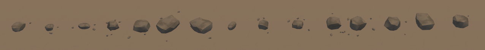  | Rock placed with a tool | Generated by the StoneScatter tool in MeshE there are several kinds |
| 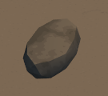 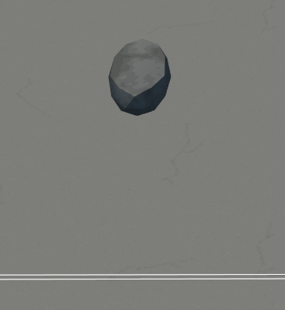 | Small rock template = rock_s1 | Amiyate |
| 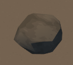 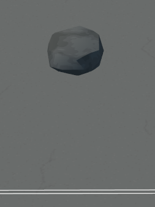 | Small rock template = rock_s2 |  |
|  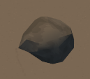 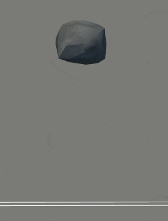 | Small rock template = rock_s3 |  |
| 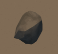 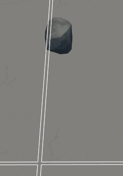 | Small rock template = rock_s4 |  |
| 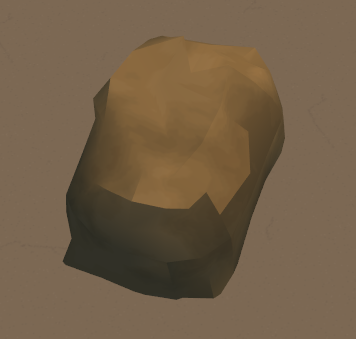 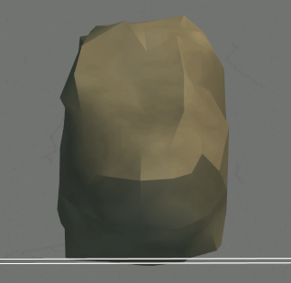 | Shit-yellow big rock template = rock_h1 |  |
| 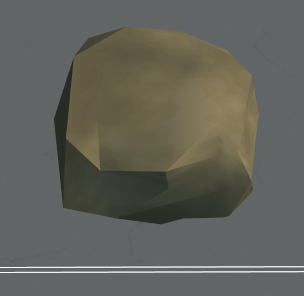 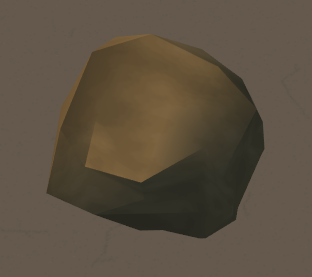 | Slightly smaller shit-yellow big rock template = rock_h3 |  |
| 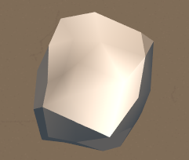 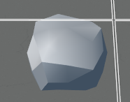 | Eye-searing medium rock template = rock_b1 | suspected material error |
| 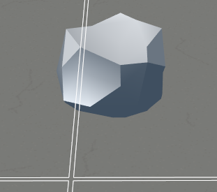 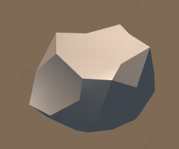 | Eye-searing medium rock template = rock_b2 | suspected material error |
| 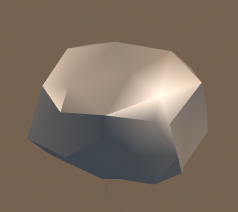 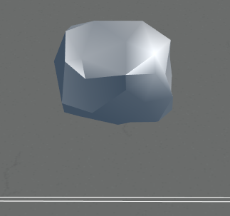 | Eye-searing medium rock template = rock_b3 | suspected material error |
| 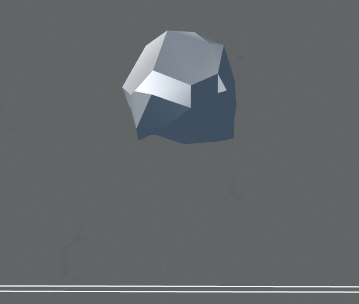 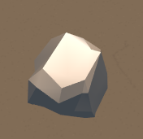 | Eye-searing small rock template = rock_b4 | suspected material error |
| 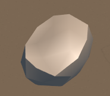 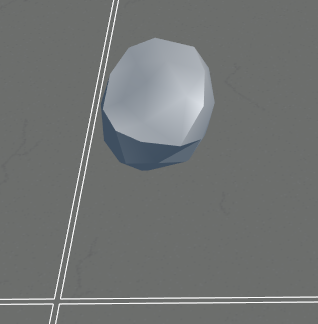 | Eye-searing small rock template = rock_m1 | suspected material error |
| 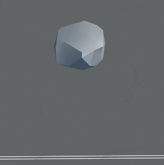 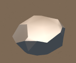 | Eye-searing small rock template = rock_m2 | suspected material error |
| 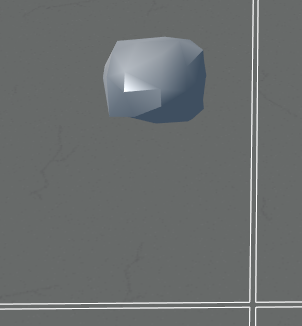 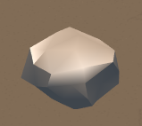 | Eye-searing small rock template = rock_m3 | suspected material error |
| 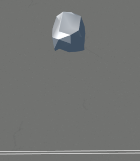 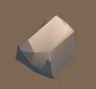 | Eye-searing small rock template = rock_m4 | suspected material error |
| 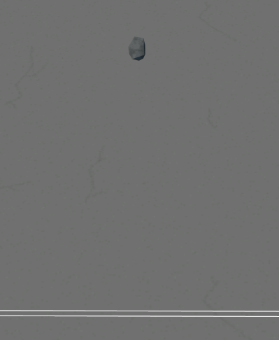 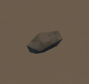 | Mini rock template = stone_1 |  |
| 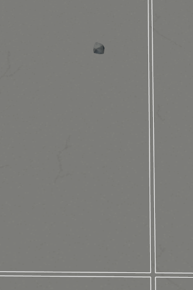 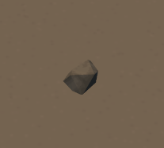 | Mini rock template = stone_2 |  |
| 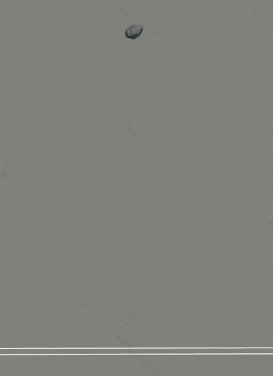 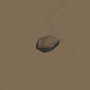 | Mini rock template = stone_3 |  |
| 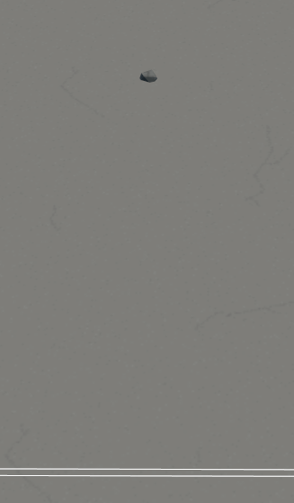 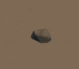 | Mini rock template = stone_4 |  |
| 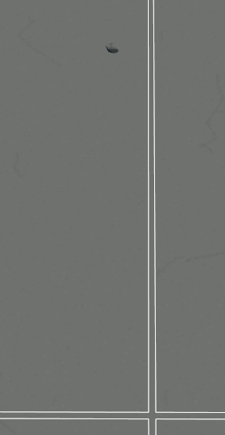 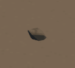 | Mini rock template = stone_5 | hey? |
| 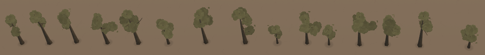  | Tree placed with a tool | Generated by the TreeScatter tool in MeshE there are several kinds |
| 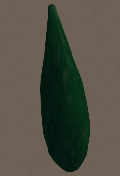 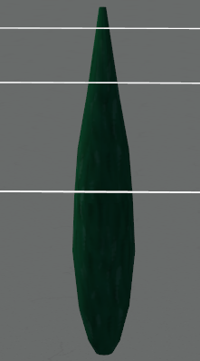 | Cypress template = cypress | this is a tree?? |
| 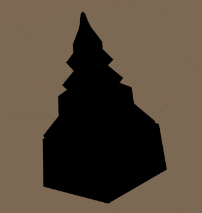 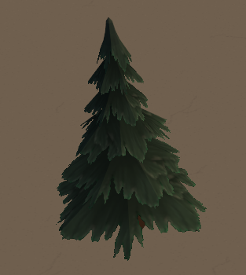 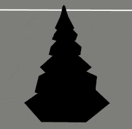 | Fir tree template = fir | suspected material error |
| 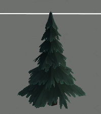 | Fir tree 1 template = fir1 |  |
| 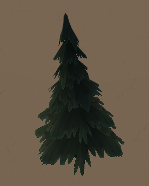 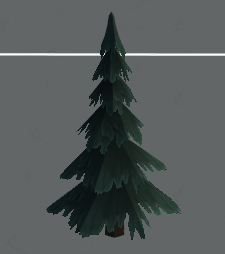 | Fir tree 2 template = fir2 |  |
| 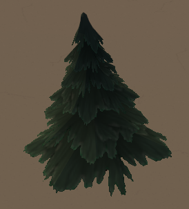 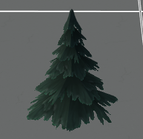 | Fir tree 3 template = fir3 |  |
|   | Palm tree 1 template = palmtree1 |  |
|   | Palm tree 2 template = palmtree2 |  |
|   | Palm tree 1 template = palmtree_1 | seems no different from the one above |
|   | Palm tree 2 template = palmtree_2 | seems no different from the one above |
|   |  Marram grass template = marram |  |
|   | Bush 0 (medium) template = bush0 |  |
|   | Bush 1 (small) template = bush1 |  |
|   | Bush 2 (small) template = bush2 |  |
|   | Bush 3 (medium) template = bush3 |  |
|   | Bush 3 variant (large) template = bush3_1 |  |
|   | Bush 3 variant, hedgerow version 1 (large) template = bush3_1_hedgerow | has a collision volume |
|   | Bush 3 variant, hedgerow version 2 (large) template = bush3_hedgerow | has a collision volume |
|   | Bush 4 (medium) template = bush4 |  |
|   | Bush 5 (medium) template = bush5 |  |
|   | Bush 5 (medium) template = bush______________5 | seems no different from the one above |
|   | Ivy template = ivy | facing it head-on the width is 0 so you can't see it; you have to look at it from the side |
|   | Reed template = reed |  |
|   | Tropical plant 1 template = tropical_plant_01 |  |
|   | Tropical plant 2 template = tropical_plant_02 |  |
|   | Tropical plant 3 template = tropical_plant_03 |  |
|   | Tropical plant 4 template = tropical_plant_04 |  |
|   | Tropical plant 5 template = tropical_plant_05 |  |
|   | Tropical plant 6 template = tropical_plant_06 |  |
|   | Tropical plant 7 template = tropical_plant_07 |  |
|   | Tropical plant 8 template = tropical_plant_08 |  |
|   | Tropical plant 9 template = tropical_plant_09 |  |
|   | Tropical plant 10 template = tropical_plant_10 |  |
|   | Tropical plant 11 template = tropical_plant_11 |  |
|   | Tropical plant 12 template = tropical_plant_12 |  |
|   | Tropical plant 13 template = tropical_plant_13 |  |
|   | Wheat template = wheat |  |

## Small props { #small }

| Preview | Name | Notes |
| --- | --- | --- |
|   | Storeroom template = weapon_rack | the camo cloth on the outside has no collision box |
|   | Armory template = armory |  |
|   | Duct template = pipe |  |
|   | T-shaped duct template = pipeT | suspected material error |
|   | Ventilation fan template = ventilator |  |
|   | Concrete fence template = enclosure |  |
|   | Concrete fence with an anarchist symbol painted on it template = enclosure_a |  |
|   | Small street lamp template = streetlantern |  |
|   | Large street lamp template = streetlight |  |
|   | Small chair template = chairset_chair | you can't sit on it; feels worse than __ and it blocks the way |
|   | Small coffee table template = chairset_table |  |
|   | Bench template = bench |  |
|   | Red oil drum template = barell_red | interactive, it explodes they're all recoloured variants; couldn't be bothered to change preview image 2 |
|   | Green oil drum template = barell_green | interactive, it explodes they're all recoloured variants; couldn't be bothered to change preview image 2 |
|   | Blue oil drum template = barell_blue | interactive, it explodes they're all recoloured variants; couldn't be bothered to change preview image 2 |
|   | Blue parasol template = parasol_blue | it breaks when a vehicle runs it over or from an explosion but it respawns after a few seconds |
|   | Yellow parasol template = parasol_yellow | it breaks when a vehicle runs it over or from an explosion but it respawns after a few seconds they're all recoloured variants; couldn't be bothered to change preview image 2 |
|   | Green parasol template = parasol_green | it breaks when a vehicle runs it over or from an explosion but it respawns after a few seconds they're all recoloured variants; couldn't be bothered to change preview image 2 |
|   | Red parasol template = parasol_red | it breaks when a vehicle runs it over or from an explosion but it respawns after a few seconds they're all recoloured variants; couldn't be bothered to change preview image 2 |
|   | Concrete barrier template = concrete_barrier |  |
|   | Stack of concrete pipes template = concrete_pipes | you can jump on top, but the collision box doesn't match, as shown |
|   | Globe statue template = world_statue |  |
|   | Tent template = tent |  |
|   | Wind turbine template = windmill |  |
|   | Windmill template = windmill_stone |  |
|   | Bowling pin statue template = bowling |  |
|   | Bird statue template = birds_statue |  |
|   | Buddha statue template = buddha |  |
|   | Obelisk template = obelisk |  |
|   | Venus statue template = venus |  |
|   | Lighthouse template = lighthouse | based on the bottom cylinder; the collision box is a cube enclosing it |
|   | Factory chimney template = factorychimney | uh |
|   | Flat grave template = grave1 |  |
|   | Pointed grave template = grave2 |  |
|   | Grave with a cross template = grave3 |  |
|   | Tall little grave template = grave4 |  |
|   | Cross headstone template = grave_cross |  |
|   | Round-topped headstone template = grave_plate1 |  |
|   | Square-topped headstone template = grave_plate2 |  |
|   | Tall column headstone template = grave_column1 |  |
|   | Short column headstone template = grave_column2 |  |
|   | Vertical barbed wire template = barbwire |  |
|   | Horizontal barbed wire template = barbwire2 |  |
|   | Wire fence template = barbwire_fence | note it floats in the air |
|   | Roadblock template = barrier |  |
|    | Raised roadblock template = barrier_open |  |
|   | Green flag template = flag_green |  |
|   | Flag pole template = flag_pole | no collision box on the steps |
|   | Well template = well |  |
|   | Cannon template = cannon | has a collision box, you can jump on it |
|   | Placard template = placard | suspected material error |
|   | Blue container template = container_blue |  |
|   | Red container template = container_red | same as above; couldn't be bothered to change preview image 2 |
|   | Green container template = container_green | same as above; couldn't be bothered to change preview image 2 |
|   | D-shaped green container template = container_greenD | suspected material error same as above; couldn't be bothered to change preview image 2 |
|   | T-shaped green container template = container_greenT | suspected material error same as above; couldn't be bothered to change preview image 2 |
|   | Yellow sun lounger template = sunchair_yellow | it breaks when a vehicle runs it over or from an explosion but it respawns after a few seconds |
|   | Red sun lounger template = sunchair_red | it breaks when a vehicle runs it over or from an explosion but it respawns after a few seconds they're all recoloured variants; couldn't be bothered to change preview image 2 |
|   | Czech hedgehog template = hedgehog |  |
|   | Fountain template = fountain |  |
|   | Wooden watchtower template = woodtower |  |
|   | Wooden watchtower 2 template = woodtower2 | seems no different from the one above |
|   | Train boxcar template = train boxcar | note there is no underscore between train and boxcar, it's a space |
|   | Big dish radar template = radar_dish |  |
|   | Suspended 15 m oil pipe template = oil_pipe_straight_15m | the support strut at the bottom has a collision box |
|   | Suspended corner oil pipe template = oil_pipe_bent_hori | note it floats in the air |
|   | Ground-level oil pipe template = oil_pipe_bent_verti | no collision box |
|   | Red awning template = awning_red | note it floats in the air |
|   | Green awning template = awning_green | note it floats in the air |
|   | Camo net template = camonet | no collision box |
|   | Advertising pillar template = ad_pillar |  |
|   | Car style 1, white template = car1_white | not a vehicle; you can't blow it up and you can't push it |
|   | Car style 1, yellow template = car1_yellow | not a vehicle; you can't blow it up and you can't push it I say this is blue they're all recoloured variants; couldn't be bothered to change preview image 2 |
|   | Car style 2, green, wreck template = car2_broken | not a vehicle; you can't blow it up and you can't push it |
|   | Car style 2, green template = car2_green | not a vehicle; you can't blow it up and you can't push it |
|   | Car style 2, grey template = car2_grey | not a vehicle; you can't blow it up and you can't push it they're all recoloured variants; couldn't be bothered to change preview image 2 |
|   | Car style 2, red template = car2_red | not a vehicle; you can't blow it up and you can't push it they're all recoloured variants; couldn't be bothered to change preview image 2 |
|   | Car style 2, silver template = car2_silver | not a vehicle; you can't blow it up and you can't push it they're all recoloured variants; couldn't be bothered to change preview image 2 |
|   | Car style 2, white template = car2_white | not a vehicle; you can't blow it up and you can't push it they're all recoloured variants; couldn't be bothered to change preview image 2 |
|   | Car style 2, yellow template = car2_yellow | not a vehicle; you can't blow it up and you can't push it they're all recoloured variants; couldn't be bothered to change preview image 2 |
|   | Car style 3, sky blue template = car3_sky | not a vehicle; you can't blow it up and you can't push it I say this is shit-yellow |
|   | Car style 3, yellow template = car3_yellow | not a vehicle; you can't blow it up and you can't push it same as above; couldn't be bothered to change preview image 2 |
|   | Construction site clutter: pile of steel pipes template = construction_part_1 |  |
|   | Control tower template = control_tower | based on the small cylinder at the bottom; the collision box is a cube enclosing it |
|   | Construction site clutter: pile of bricks template = contruction_bricks |  |
|   | Tower crane template = crane | no collision box |
|   | Tower crane base template = crane_base | no collision box |
|   | Destroyed bunker 1 template = destroyed_bunker_1 | no collision box |
|   | Dock crane template = dock_crane | no collision box |
|   | Fort entrance template = fort_entrance | note it floats in the air suspected material error |
|   | Broken oil tank template = gas_tankT | looks like it got scorched in a fire? suspected material error |
|   | Hay stack template = hay_stack |  |
|   | Gas station template = gas_station | the fuel pump on the right has no collision box |
|   | Oil tank template = gas_tank | not a vehicle; you can't blow it up and you can't push it |
|   | Locomotive template = locomotive | broken version |
|   | Old rowboat template = old_rowboat | the collision box is a rectangle and you can't climb over it |
|   | Old truck template = old_truck |  |
|   | Pagoda statue template = pagoda_statue |  |
|   | Tall pagoda statue template = pagoda_statue_tall |  |
|   | Pickup truck template = pickup | not a vehicle; you can't blow it up and you can't push it suspected material error |
|   | Pickup truck wreck template = pickup_broken | not a vehicle; you can't blow it up and you can't push it |
|   | Green pickup truck template = pickup_green | not a vehicle; you can't blow it up and you can't push it |
|   | Khaki pickup truck template = pickup_khaki | not a vehicle; you can't blow it up and you can't push it they're all recoloured variants; couldn't be bothered to change preview image 2 |
|   | Red pickup truck template = pickup_red | not a vehicle; you can't blow it up and you can't push it they're all recoloured variants; couldn't be bothered to change preview image 2 |
|   | Yellow pickup truck template = pickup_yellow | not a vehicle; you can't blow it up and you can't push it they're all recoloured variants; couldn't be bothered to change preview image 2 |
|   | Ballastless track slab template = railroad_bump | no collision box |
|   | Curved railway track template = railroad_curved_element | no collision box |
|   | 50 m straight railway track template = railroad_straight_element_50m | has a collision box, but no collision volume |
|   | Rubber boat wreck template = rubber_boat_broken | no collision box |
|   | Ruin debris template = ruin_debris1 | suspected material error |
|   | Ruin debris template = ruin_debris2 | suspected material error |
|   | Ruin debris template = ruin_debris3 | suspected material error |
|   | Ruin debris template = ruin_debris4 | suspected material error |
|   | RWR statue template = rwr |  |
|   | Scarecrow template = scarecrow |  |
|   | Silo template = silo |  |
|   | Small oil tank template = small_oil_tank |  |
|   | Stairs template = stairs1 | no collision box |
|   | Statue 2 template = statue2 | the base has no collision box, the statue in the middle does |
|   | Another statue 2 template = statue_2 |  |
|   | Stook of straw template = stook |  |
|   | Pile of small trash on the street template = street_ground_trash |  |
|   | Tall tower template = tower_big | no collision box |
|   | Pile of logs template = trunks |  |
|   | Car tyre standing up and leaning template = tyre1_lean |  |
|   | Column of car tyres template = pickup_broken |  |
|   | Yellow van template = van_yellow | not a vehicle; you can't blow it up and you can't push it |
|   | Van wreck template = vanT_broken | not a vehicle; you can't blow it up and you can't push it |
|   | Wooden road sign template = wooden_road_sign |  |
|   | WW2 bunker template = ww2_bunker |  |
|   | WW2 prison bunker template = ww2_bunker_prison | seems no different from the one above |
|   | WW2 plane wreck template = ww2_plane_broken | no collision box |
|   | Car 1 template = car1 | not a vehicle; you can't blow it up and you can't push it suspected material error |
|   | Car 2 template = car2 | not a vehicle; you can't blow it up and you can't push it suspected material error |
|   | Car 3 template = car3 | not a vehicle; you can't blow it up and you can't push it suspected material error |
|   | Car 4 template = car4 | not a vehicle; you can't blow it up and you can't push it suspected material error |

## Large props { #large }

| Preview | Name | Notes |
| --- | --- | --- |
|   | Extra-large oil tank template = big_oil_tank | the platform below has no collision box, only the cylinder in the middle does |
|   | Medium house template = medi_house |  |
|   | Hangar template = hangar | no collision box |
|   | Hangar 1 template = hangar1 | the door is on the back side |
|   | Hangar 2 template = hangar2 | no collision box |
|   | Warehouse template = warehouse |  |
|   | Warehouse 2 template = warehouse2 | no collision box |
|   | Barn template = barn | no collision box |
|   | Mosque template = mosque | only the main body has a collision box; the small buildings stuck to it don't |
|   | Very large mosque template = mosque2 | huge as hell only the main body has a collision box; the buildings outside don't |
|   | Church template = church | no collision box |
|   | Small chapel template = chapel | the wall sticking out at the side has no collision box, the main body does |
|   | Aircraft carrier template = aircraft_carrier | no collision box |
|   | Large tent template = big_tent | no collision box |
|   | Cargo ship template = cargo_ship | no collision box it sits flush with the ground; you have to make your own platform |
|   | Castle 2 template = castle2 | no collision box |
|   | Cottage template = cottage |  |
|   | Hotel template = hotel | no collision box |
|    | Military barracks template = military_house | no collision box |
|   | Ruins template = ruins_1 | no collision box |
|   | Ruins template = ruins_2 | no collision box suspected material error |
|   | Ruins template = ruins_3 | no collision box |
|   | Ruins template = ruins_4 | no collision box |
|   | Shooting range template = shooting_range |  |
|   | Temple template = temple | a small part at the entrance has no collision box |
|   | Tunnel template = tunnel | no collision box |

## Special props { #special }

| Preview | Name | Notes |
| --- | --- | --- |
|   | Single-wire utility pole template = post1_1 | this one is special, its main use is placing them in a chain looking at the normal is not much use, the pole's direction is the bisector of the angle between the two wires as shown below: |
|   | Two-wire utility pole template = post1_ |  |
|   | Three-wire utility pole template = post1_3 |  |
|   | Long-arm utility pole template = post1_4 |  |

## Objects with serious problems { #broken }

| Preview | Name | Notes |
| --- | --- | --- |
|  | Wooden barrel template = barrel_wood | crashes on load |
|  | Breakable barrel template = barrel_breakable | crashes on load |
|  | Medical crate template = crate_medical | crashes on load |
|  | Breakable crate template = crate_breakable | crashes on load |
|  | Bunker template = bunker | material not loaded |
|  | Old large house template = old_big_house | material not loaded |
|  | Old small house template = old_small_house | material not loaded |
|  | Furrow template = furrow | material not loaded |
|  | Short raised furrow template = furrow_height | material not loaded |
|  | Long raised furrow 1 template = furrow_height1 | material not loaded |
|  | Long raised furrow 2 template = furrow_height2 | material not loaded |
|  |  template = chargo_tent | material not loaded |
|  | Ammo crate template = ammo_crate | material not loaded |
|  | Armory crate template = armory_crate | material not loaded |
|  | Destroyed artillery limber template = artillery_limber_destroyed | material not loaded |
|  | Attack ship template = attack_ship | material not loaded |
|  | B29 bomber, form 1 template = b29_1 | material not loaded |
|  | B29 bomber, form 2 template = b29_2 | material not loaded |
|  | B29 bomber, form 3 template = b29_3 | material not loaded |
|  | Crashed C47 template = c47_crashed | material not loaded |
|  | Tree canopy template = canopy_01 | material not loaded |
|  | Car style 1, black template = car1_black | material not loaded |
|  | Car style 1, blue template = car1_blue | material not loaded |
|  | Car style 1, brown template = car1_brown | material not loaded |
|  | Car style 1, green template = car1_green | material not loaded |
|  | Car style 1, pink template = car1_pink | material not loaded |
|  | Car style 1, red template = car1_red | material not loaded |
|  | Car style 2, black template = car2_black | material not loaded |
|  | Car style 2, blue template = car2_blue | material not loaded |
|  | Car style 2, brown template = car2_brown | material not loaded |
|  | Car style 3, black template = car3_black | material not loaded |
|  | Car style 3, blue template = car3_blue | material not loaded |
|  | Car style 3, green template = car3_green | material not loaded |
|  | Cargo tent template = cargo_tent | material not loaded |
|  | Aircraft carrier template = carrier | material not loaded |
|  | Container template = container | material not loaded |
|  | Cooling tower template = cooling_tower | material not loaded |
|  | Cottage 2 template = cottage_2 | material not loaded |
|  | Sports car wreck template = coupeT_broken | material not loaded |
|  | Fighter plane template = fighter | material not loaded |
|  | US military fighter plane template = fighter_green | material not loaded |
|  | French church template = french_church | material not loaded |
|  | Mirrored French church template = french_church_mirrored | material not loaded |
|  | Headquarters building template = headquarters_building | material not loaded |
|  | Higgins landing craft template = higgins_prop | material not loaded |
|  | Griffin statue template = griffon_statue | material not loaded |
|  | Jack's horse, form 1 template = horse_casualty1 | material not loaded |
|  | Jack's horse, form 2 template = horse_casualty2 | material not loaded |
|  | Jack's horse, form 3 template = horse_casualty3 | material not loaded |
|  | Stack of oil drums template = oil_drum_stack | material not loaded |
|  | Stack of oil drums with a tarp template = oil_drum_stack_tarp | material not loaded |
|  | Blue pickup truck template = pickup_blue | material not loaded |
|  | T-shaped pickup truck wreck template = pickupT_broken | material not loaded |
|  | Plank template = plank | material not loaded the previous template loads fine  |
|  | Quonset hut template = quonset_hut | material not loaded |
|  | Sedan wreck template = sedanT_broken | material not loaded |
|  | Shipping container template = shipping_container | material not loaded |
|  | Placed bomb template = static_bomb | material not loaded |
|  | Placed torpedo template = static_torpedo | material not loaded |
|  | Statue template = statue | material not loaded |
|  | Another statue 2 base template = statue_2_socle | material not loaded |
|  | Stump 1 template = stump1 | material not loaded |
|  | Stump 2 template = stump2 | material not loaded |
|  | Stump 3 template = stump3 | material not loaded |
|  | Stump 4 template = stump4 | material not loaded |
|  | Blue sun lounger template = sunchair_blue | material not loaded |
|  | Green sun lounger template = sunchair_green | material not loaded |
|  | Wreck of T template = T_broken | material not loaded |
|  | 1934 tent template = tent_m1934 | material not loaded |
|  | 1934 tent, style 2 template = tent_m1934_2 | material not loaded |
|  | 1934 medical tent template = tent_m1934_medical | material not loaded |
|  | Truss bridge template = truss_bridge | material not loaded |
|  | Blue van template = van_blue | material not loaded |
|  | Brown van template = van_brown | material not loaded |
|  | Green van template = van_green | material not loaded |
|  | Khaki van template = van_khaki | material not loaded |
|  | Red van template = van_red | material not loaded |
|  | Sky-blue van template = van_sky | material not loaded |
|  | Waco glider template = waco_glider_1 | material not loaded |
|  | Waco glider template = waco_glider_2 | material not loaded |
|  | Storage ship template = weapon_rack_ship | material not loaded |
|  |  template = horse_casualty27 | material not loaded |
|  |  template = horse_casualty28 | material not loaded |
|  |  template = horse_casualty29 | material not loaded |
|  |  template = horse_casualty30 | material not loaded |
|  |  template = horse_casualty31 | material not loaded |
|  | Christmas cactus (small) template = xmas_cactus | asset missing the previous template loads fine |
|  | Rounder shit-yellow big rock template = rock_h2 | asset missing the previous template loads fine |
