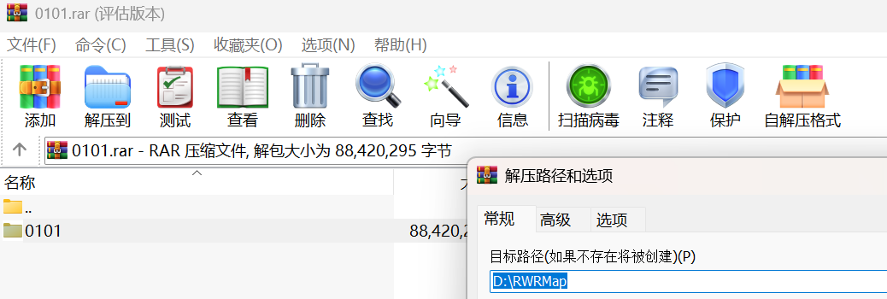
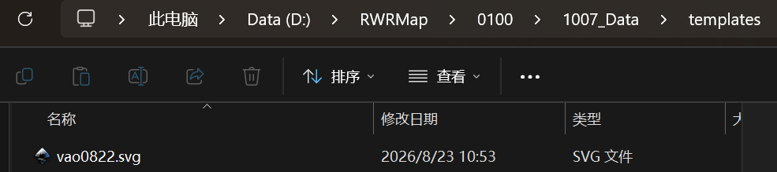
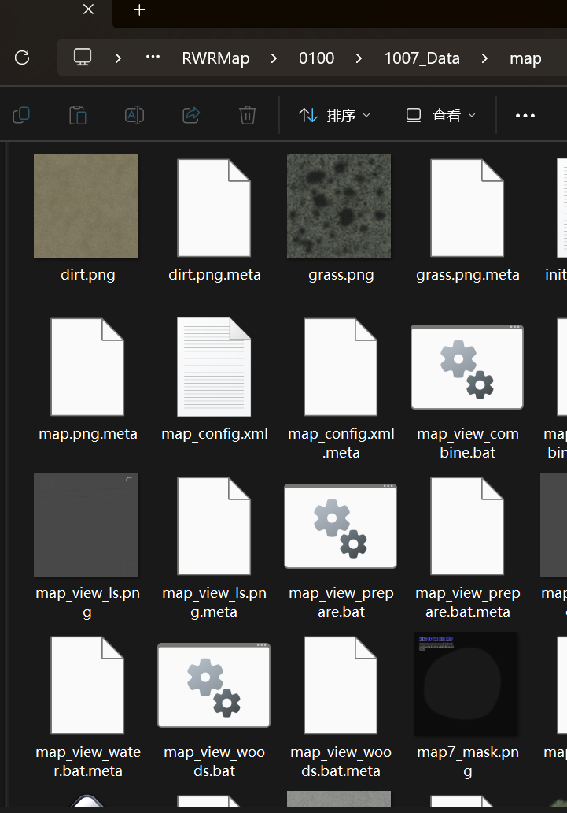
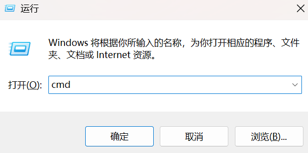
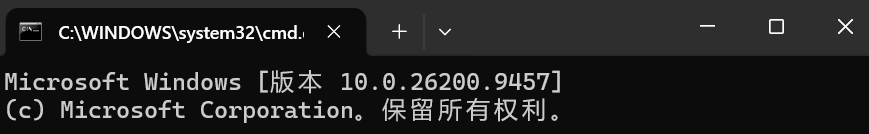
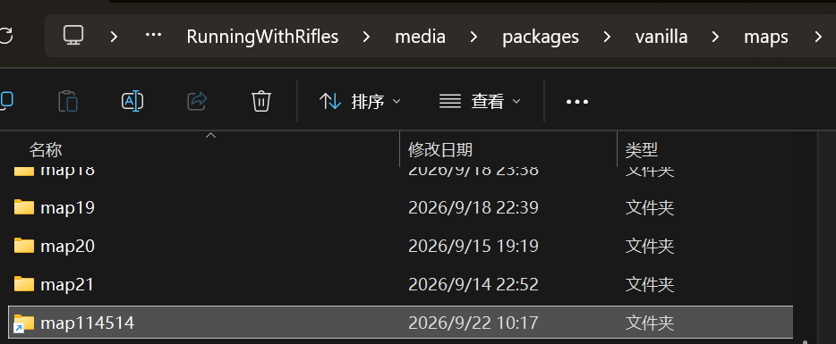
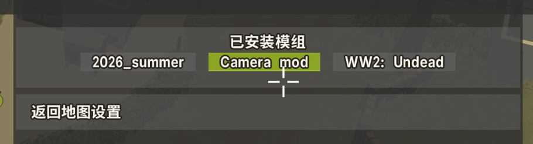
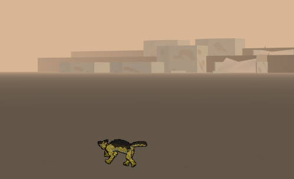
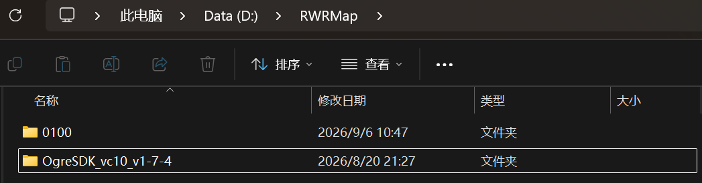

# 准备工作

## 一、地编下载后如何配置

1.将下载后的文件解压到你自己喜欢的路径。



2.在1007_Data中创建一个templates文件夹与map文件夹。


3.下载群内的最新模板，目前是vao0822.svg，放入地编的templates文件夹中。

> 注：目前只有原版正常地图模板，沙漠与雪地的模板暂未制作完成。



4.选择你喜欢的地图放入地编的map文件夹里，注意只能选一个，并且将那个地图文件夹下所有的相关文件都扔进去，如果拿不准就扔map7，因为这就是上面模板的底稿，可以防止出现一些诡异问题。

> 注：RWR原版地图分为三个类型（原版中的原版、原版中的沙漠、原版中的雪地），用哪个类型就要装载对应的模板，目前只做了原版中的原版类型模板，所以只能使用\vanilla\maps中的文件，过于特殊的 map19与\vanilla.desert\maps路径和\vanilla.winter\maps路径中的地图可能会出现适配问题（当然不影响只是打开看看，但是以这些地图为底子去做还是算了）。




> *上面例子图我地编文件夹里一堆.meta文件用不着管，只是个示例，把左边的全扔右边地编文件夹里就行

## 二、如何同步地编与RWR的文件夹

1.首先Win+R，输入cmd打开命令提示符界面。





2.之后输入命令：

```text
mklink /J "你的小兵步枪要创建的地图文件夹" "地编的文件夹"
```

> 注：<br>每个人路径都不一样，按自己的来；<br>第一个文件夹路径需要保证输入命令前是未被创建的。


3.完成后效果。



## 三、如何开启RWR自带的相机mod

1.steam游戏库界面，在左侧列表找到右键RWR，打开属性，输入：

```text
skip_nat_server_usage debugmode no_simulation auto_update_tree_foliage big_water
```


2.打开游戏，点击开始新的快速比赛模式，然后点击加载模组。


3.选中Camera mod。



4.进入地图，按下F4动动鼠标看看有没有效果。



其中：

F3是开关用于拍摄宣传片的滤镜

F4是开关自由视角

F5是开关法线模式，用于查看碰撞箱等

F6是切换到凌晨/傍晚

F7是开关GUI显示

## OgreSDK下载


1.群文件下载OgreSDK_vc10_v1-7-4.zip，解压在自己喜欢的路径，推荐和地编文件夹一块。



2.没了，之后3rdParSettings要用，现在先不说 :)
