# Vehicle Scatter

| 预览 | 名称 | 备注 |
| --- | --- | --- |
|  | 机枪悍马 humvee.vehicle |  |
|  | 榴弹悍马 humvee_gl.vehicle |  |
|  | 重生车 armored_truck.vehicle |  |
|  | 信号车 radar_truck.vehicle | 只在Invasion有效，快速比赛模式无法正常生成 下面标未生成的也可能是这个特性 |
|  | 军械车 mobile_armory.vehicle |  |
|  | 气垫船 rubber_boat.vehicle |  |
|  | 巡逻艇 patrol_ship.vehicle |  |
|  | M113迫击炮装甲车 m113_tank_mortar.vehicle |  |
|  | 全地形车 atv_base.vehicle |  |
|  | 补给车 atv_armory.vehicle |  |
|  | “陶”式反坦克导弹 tow.vehicle |  |
|  | “陶”式反坦克导弹 tow_2.vehicle | 与上一个相比这个可以看作是一次性部署物，被摧毁后十小时才会再次生成 |
|  | 沙袋 cover1.vehicle |  |
|  | 重机枪 deployable_mg.vehicle |  |
|  | 重机枪 deployable_mg_2.vehicle | 与上一个相比这个可以看作是一次性部署物，被摧毁后十小时才会再次生成 |
|  | M134加特林机枪 deployable_minig.vehicle |  |
|  | M134加特林机枪 deployable_minig_2.vehicle | 与上一个相比这个可以看作是一次性部署物，被摧毁后十小时才会再次生成 |
|  | 迫击炮 mortar.vehicle |  |
|  | 迫击炮 mortar_2.vehicle | 与上一个相比这个可以看作是一次性部署物，被摧毁后十小时才会再次生成 |
|  | 自动榴弹发射器 deployable_gl.vehicle |  |
|  | 自动榴弹发射器 deployable_gl_2.vehicle | 与上一个相比这个可以看作是一次性部署物，被摧毁后十小时才会再次生成 |
|  | 信号塔 radar_tower.vehicle |  |
|  | 油罐 gas_tank.vehicle |  |
|  | 无线电干扰发生器 radio_jammer.vehicle |  |
|  | 无线电干扰发生器 radio_jammer2.vehicle | 与上一个相比这个可以看作是一次性部署物，被摧毁后十小时才会再次生成 |
|  | 水塔 water_tower.vehicle |  |
|  | 迫击炮弹药箱 mortar_ammunition_crates.vehicle |  |
|  | 重生信号弹 para_spawn.vehicle | 是已激活的重生信号弹 |
| 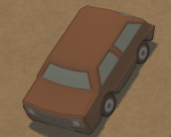 | 款式一棕色轿车 deco_car1_brown.vehicle |  |
| 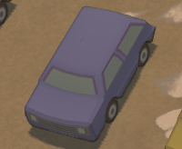 | 款式一蓝色轿车 deco_car1_blue.vehicle |  |
| 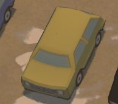 | 款式一黄色轿车 deco_car1_yellow.vehicle |  |
| 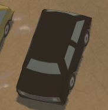 | 款式一黑色轿车 deco_car1_black.vehicle |  |
| 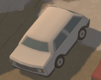 | 款式一白色轿车 deco_car1_white.vehicle |  |
| 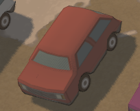 | 款式一红色轿车 deco_car1_red.vehicle |  |
| 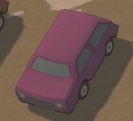 | 款式一粉色轿车 deco_car1_pink.vehicle |  |
| 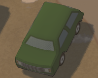 | 款式一绿色轿车 deco_car1_green.vehicle |  |
| 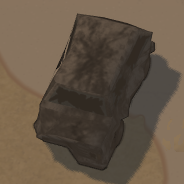 | 款式一轿车残骸 deco_car1_broken.vehicle |  |
| 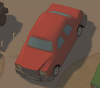 | 款式二红色轿车 deco_car2_red.vehicle |  |
| 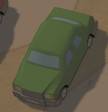 | 款式二绿色轿车 deco_car2_green.vehicle |  |
| 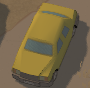 | 款式二黄色轿车 deco_car2_yellow.vehicle |  |
| 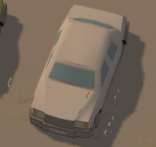 | 款式二白色轿车 deco_car2_white.vehicle |  |
| 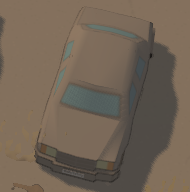 | 款式二银色轿车 deco_car2_silver.vehicle |  |
| 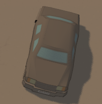 | 款式二灰色轿车 deco_car2_grey.vehicle |  |
| 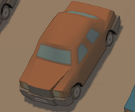 | 款式二棕色轿车 deco_car2_brown.vehicle |  |
| 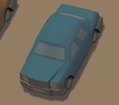 | 款式二蓝色轿车 deco_car2_blue.vehicle |  |
| 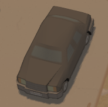 | 款式二黑色轿车 deco_car2_black.vehicle |  |
| 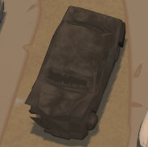 | 款式二轿车残骸 deco_car2_broken.vehicle |  |
| 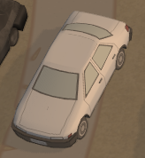 | 款式三白色轿车 deco_car3_sky.vehicle |  |
| 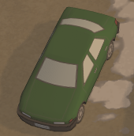 | 款式三旅色轿车 deco_car3_green.vehicle |  |
| 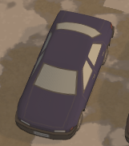 | 款式三蓝色轿车 deco_car3_blue.vehicle |  |
| 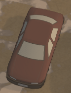 | 款式三红色轿车 deco_car3_red.vehicle |  |
| 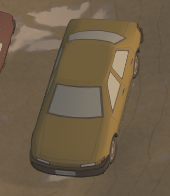 | 款式三黄色轿车 deco_car3_yellow.vehicle |  |
| 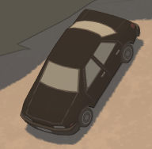 | 款式三黑色轿车 deco_car3_black.vehicle |  |
| 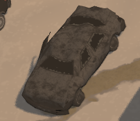 | 款式三轿车残骸 deco_car3_broken.vehicle |  |
| 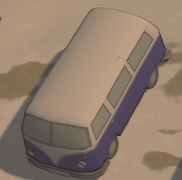 | 蓝色面包车 deco_van_blue.vehicle |  |
| 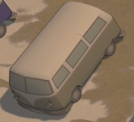 | 卡其色面包车 deco_van_khaki.vehicle |  |
| 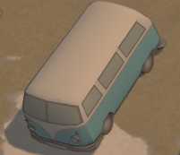 | 白色面包车 deco_van_sky.vehicle |  |
| 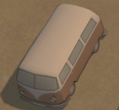 | 棕色面包车 deco_van_brown.vehicle |  |
| 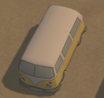 | 黄色面包车 deco_van_yellow.vehicle |  |
| 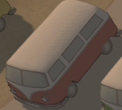 | 红色面包车 deco_van_red.vehicle |  |
| 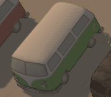 | 绿色面包车 deco_van_green.vehicle |  |
| 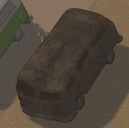 | 面包车残骸 deco_van_broken.vehicle |  |
| 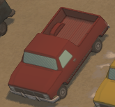 | 红色皮卡车 deco_pickup_red.vehicle |  |
| 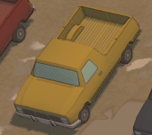 | 黄色皮卡车 deco_pickup_yellow.vehicle |  |
| 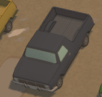 | 蓝色皮卡车 deco_pickup_blue.vehicle |  |
| 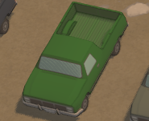 | 绿色皮卡车 deco_pickup_green.vehicle |  |
| 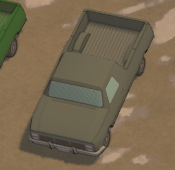 | 卡其色皮卡车 deco_pickup_khaki.vehicle |  |
| 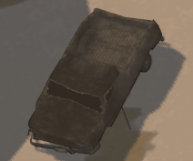 | 皮卡车残骸 deco_pickup_broken.vehicle |  |
| 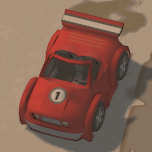 | 一号赛车 racing_car1.vehicle |  |
| 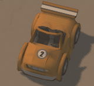 | 二号赛车 racing_car2.vehicle |  |
| 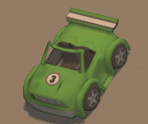 | 三号赛车 racing_car3.vehicle |  |
| 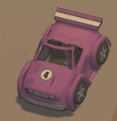 | 四号赛车 racing_car4.vehicle |  |
| 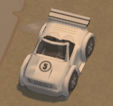 | 五号赛车 racing_car5.vehicle |  |
| 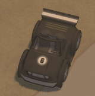 | 六号赛车 racing_car6.vehicle |  |
| 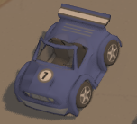 | 七号赛车 racing_car7.vehicle |  |
| 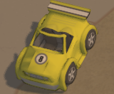 | 八号赛车 racing_car8.vehicle |  |
|  | 粉嫩熊猫车 jeep_ee.vehicle | 未生成 |
| 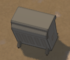 | 垃圾箱 dumpster.vehicle |  |
|  | 拖拉机 tractor.vehicle |  |
|  | [不到是啥] flare_checkpoint.vehicle | 未生成 |
|  | [不到是啥] heli_extraction_broken.vehicle | 未生成 |
|  | [不到是啥] heli_broken1.vehicle | 未生成 |
|  | [不到是啥] heli_broken2.vehicle | 未生成 |
|  | [不到是啥] cargo_helicopter_broken.vehicle | 未生成 |
|  | [不到是啥] cargo_helicopter.vehicle | 未生成 |
|  | 运货卡车 cargo_truck.vehicle | 未生成 |
|  | 运囚车 prison_bus.vehicle | 未生成 |
|  | 监狱大门 prison_door.vehicle | 未生成 |
|  | 监狱天窗 prison_hatch.vehicle | 未生成 |
|  | [不到是啥] tank_trap.vehicle | 未生成 |
|  | [不到是啥] special_cargo_vehicle1.vehicle | 未生成 |
|  | [不到是啥] special_cargo_vehicle2.vehicle | 未生成 |
|  | [不到是啥] special_cargo_vehicle3.vehicle | 未生成 |
|  | [不到是啥] special_cargo_vehicle4.vehicle | 未生成 |
|  | [不到是啥] special_cargo_vehicle5.vehicle | 未生成 |
|  | [不到是啥] special_crate1.vehicle | 未生成 |
|  | [不到是啥] special_crate2.vehicle | 未生成 |
|  | [不到是啥] special_crate3.vehicle | 未生成 |
|  | [不到是啥] special_crate4.vehicle | 未生成 |
|  | [不到是啥] special_crate5.vehicle | 未生成 |
|  | [不到是啥] special_crate6.vehicle | 未生成 |
|  | [不到是啥] special_crate7.vehicle | 未生成 |
|  | [不到是啥] special_crate8.vehicle | 未生成 |
|  | [不到是啥] special_crate9.vehicle | 未生成 |
|  | [不到是啥] special_crate10.vehicle | 未生成 |
|  | [不到是啥] special_crate11.vehicle | 未生成 |
|  | [不到是啥] special_crate12.vehicle | 未生成 |
|  | [不到是啥] special_crate13.vehicle | 未生成 |
|  | [不到是啥] special_crate14.vehicle | 未生成 |
|  | [不到是啥] special_crate15.vehicle | 未生成 |
|  | [不到是啥] special_crate16.vehicle | 未生成 |
|  | [不到是啥] special_crate17.vehicle | 未生成 |
|  | [不到是啥] special_crate18.vehicle | 未生成 |
|  | [不到是啥] special_crate19.vehicle | 未生成 |
|  | [不到是啥] special_crate20.vehicle | 未生成 |
|  | [不到是啥] special_crate21.vehicle | 未生成 |
|  | [不到是啥] special_crate22.vehicle | 未生成 |
|  | [不到是啥] special_crate23.vehicle | 未生成 |
|  | [不到是啥] special_crate24.vehicle | 未生成 |
|  | [不到是啥] special_crate25.vehicle | 未生成 |
|  | [不到是啥] special_crate26.vehicle | 未生成 |
|  | [不到是啥] special_crate27.vehicle | 未生成 |
|  | [不到是啥] special_crate28.vehicle | 未生成 |
|  | [不到是啥] special_crate29.vehicle | 未生成 |
|  | [不到是啥] special_crate30.vehicle | 未生成 |
|  | [不到是啥] special_crate31.vehicle | 未生成 |
|  | [不到是啥] special_crate32.vehicle | 未生成 |
|  | [不到是啥] special_crate33.vehicle | 未生成 |
|  | [不到是啥] special_crate34.vehicle | 未生成 |
|  | [不到是啥] special_crate35.vehicle | 未生成 |
|  | [不到是啥] special_crate36.vehicle | 未生成 |
|  | [不到是啥] special_crate37.vehicle | 未生成 |
|  | [不到是啥] special_crate38.vehicle | 未生成 |
|  | [不到是啥] special_crate39.vehicle | 未生成 |
|  | [不到是啥] special_crate40.vehicle | 未生成 |
|  | [不到是啥] special_crate41.vehicle | 未生成 |
|  | [不到是啥] special_crate_wood1.vehicle | 未生成 |
|  | [不到是啥] special_crate_wood2.vehicle | 未生成 |
|  | [不到是啥] special_crate_wood3.vehicle | 未生成 |
|  | [不到是啥] special_crate_wood4.vehicle | 未生成 |
|  | [不到是啥] special_crate_wood5.vehicle | 未生成 |
|  | [不到是啥] special_crate_wood6.vehicle | 未生成 |
|  | [不到是啥] special_crate_wood7.vehicle | 未生成 |
|  | [不到是啥] special_crate_wood8.vehicle | 未生成 |
|  | [不到是啥] special_crate_wood9.vehicle | 未生成 |
|  | [不到是啥] special_crate_wood10.vehicle | 未生成 |
|  | 雷达坦克 radar_tank.vehicle | 未生成 |
|  | 雷达坦克 radar_tank2.vehicle | 未生成 |
|  | 火神坦克 vulcan_tank.vehicle |  |
|  | 沙漠巡逻车 buggy.vehicle |  |
|  | 武装皮卡 technical.vehicle |  |
|  | 陶氏鼬鼠 wiesel_tow.vehicle |  |
|  | 陶氏鼬鼠空投信标 wiesel_spawn.vehicle | 会有间隔的一直生成 |
|  | 香蕉车 banana_car.vehicle |  |
|  | 香蕉车空投信标 banana_car_spawn.vehicle | 会有间隔的一直生成 |
| 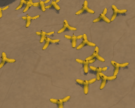 | 香蕉皮生成器 banana_peel_spawner.vehicle | 就是一直往外蹦香蕉车爆炸的香蕉皮 会有间隔的一直生成，间隔很短 |
|  | G17/A1两栖战车 aav7.vehicle |  |
|  | G17/A1两栖战车空投信标 aav7_spawn.vehicle | 会有间隔的一直生成 |
|   | 掩体空投信标 cover_crate_para.vehicle | 会有间隔的一直生成 |
|  | emp中介 emp.vehicle | 未生成 |
|  | 武装卡车 guntruck.vehicle |  |
|  | 武装卡车空投中介 guntruck_para.vehicle | 武装卡车空投中介，只会开局生成一次，效果就是刷个武卡下来 |
|  | 武装卡车空投信标 guntruck_spawn.vehicle | 会有间隔的一直生成 |
|  | “黄蜂”导弹发射器 hornet.vehicle |  |
|  | “黄蜂”导弹发射器 hornet_2.vehicle | 与上一个相比这个可以看作是一次性部署物，被摧毁后十小时才会再次生成 |
|  | ACAV步兵战车 m113_tank_acav.vehicle |  |
|  | 冰淇淋车 icecream.vehicle | 未生成 |
|  | 救护车 medivan.vehicle | 未生成 |
|  | [不到是啥] repair.vehicle | 未生成 |
|  | 修理臂 repair_crane.vehicle | 未生成 |
|  | ACAV步兵战车空投信标 vulcan_acav_spawn.vehicle | 会有间隔的一直生成 |
|  | 维修车 zjx19.vehicle | 未生成 此为老版本已被删掉的维修车 而新版本的zjx19_auto.vehicle没被记录到common.resources里，也无法生成 |
|  | 维修车空投信标 zjx19_spawn.vehicle | 未生成，原因同上 |
|  | 机炮鼬鼠 wiesel_mk20.vehicle |  |
|  | NOXE Ghost导弹发射车 noxe.vehicle |  |
|  | SEV-90反战车坦克 sev90.vehicle |  |
|  | Legion步兵坦克 legion.vehicle |  |
|  | 烈焰装甲运输车 flamer_tank.vehicle |  |
|  | M528火力支援车 m528.vehicle |  |
|  | VFS装甲侦察车 vfs_at.vehicle |  |
|  | 圣诞快乐车 jeep_xmas.vehicle | 未生成 |
|  | 圣诞快乐车空投信标 jeep_xmas_spawn.vehicle | 未生成 |
|  | 导弹发射器 missile_launcher.vehicle |  |
|  | 军工铲刨的小掩体 sandbag_cover.vehicle |  |
|  | 狗狗箱子 dogcrate_para.vehicle | 在地上生成，然后破裂刷出一只狗子 会有间隔的一直生成 |
|  | 一级圆程式赛车 f1.vehicle |  |
|  | 一级圆程式赛车空投信标 f1_spawn.vehicle | 会有间隔的一直生成 |
|  | LAI-109多管火箭炮车 lai-109.vehicle |  |
|  | LAI-109多管火箭炮车空投信标 lai-109_spawn.vehicle | 会有间隔的一直生成 |
|  | LAILV-002装甲运兵车 lailv-002.vehicle |  |
|  | LAILV-002装甲运兵车空投信标 lailv-002_spawn.vehicle | 会有间隔的一直生成 |
|  | MMLS-528自行布雷系统 mmls-528.vehicle |  |
|  | MMLS-528自行布雷系统空投信标 mmls-528_spawn.vehicle | 会有间隔的一直生成 |
|  | 雪人 snowman.vehicle | 圣诞活动的休眠状态小雪人，但是因为没脚本刷出来这个也只能被推着跑 无法激活 |
