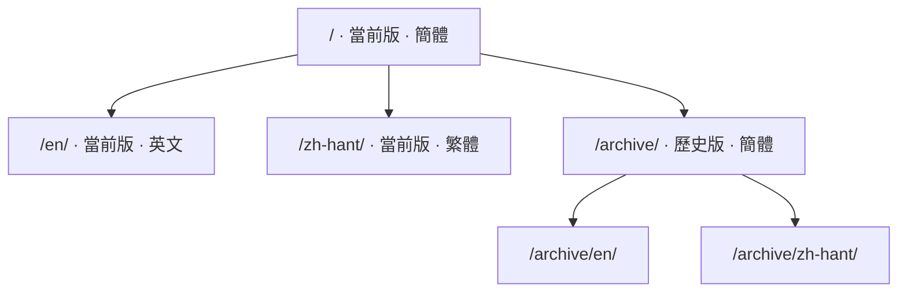

# 關於

這份手冊來自 RWR 地圖編輯組的內部文檔《鼠書》，以及組裡維護的模型清單表。

|  |  |
| --- | --- |
| 地編版本 | 0101 |
| 手冊編輯日期 | 20260922 |
| 當前編輯者 | HamSter |
| 清單表模板版本 | vao0822 |

## 兩份原件

| 原件 | 形態 | 變成了站上的哪一部分 |
| --- | --- | --- |
| 《鼠書》 | 單頁 HTML，54 張內嵌圖 | 準備工作、地編界面、設置文件 |
| 清單表 | 5 張工作表的 Excel，705 張浮動圖 | 模型清單的五頁 |

## 網址是怎麼排的

版本在前、語言在後，所以同一頁在不同版本、不同語言下各有各的地址：

## 原文裡還沒查證的部分

原文自己標了「待試」的地方照原樣留着，在導航裡掛一枚「未完成」的標記；
那些「據說是這樣」的說法也一個字沒改。**這份搬運不替原文作判斷。**

!!! quote "原文的語氣"
    組裡寫這份東西是給自己人看的，所以寫得直：「加載時崩潰」「無碰撞箱」
    「千萬別把材質錯誤全部歸類成是模板類 Mesh」。這些話都原樣留着，
    沒有潤成書面語——潤過之後，讀者反而判斷不出它有多確定。
