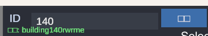
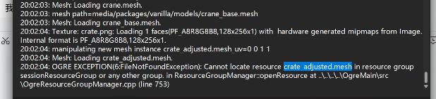
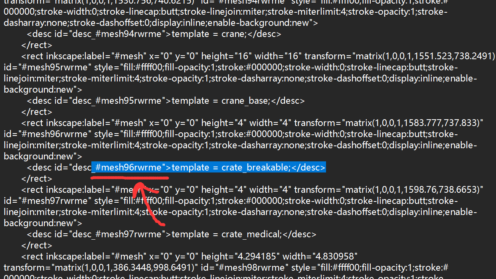

# ID 搜索功能說明 { #id-search }

EDITOR · 報錯裡那個數字是什麼

地編報錯通常會甩給你一個 ID。按這個 ID 就能把對應的物件在地圖上找出來——
這是修圖時最常用的一招。

1. 先在報錯信息裡看 ID（或者看下面「找問題」那幾張圖裡 ID 出現的位置）。

    

2. 把 ID 填進搜索框，搜。

    

## 一些找問題的運用

下面這幾張是原文給的例子，都是先拿到 ID、再回到地圖上定位：

!!! tip "ID 會變"
    地編每次保存後都會重新排一遍 ID，編號可能和上一次不一樣。
    所以**記下來的是這一刻的 ID**，隔一次保存再去搜，未必還是它。
