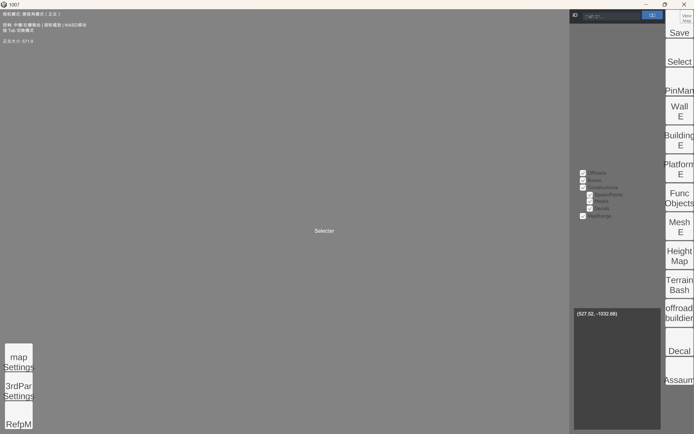

# 總導航 { #overview }

EDITOR · 頂欄上都有什麼

地編頂欄上排着十四個按鈕，各管一件事。下面按從左到右的順序列出來，
點進去是它自己的那一節。

/// caption
地編主界面。頂欄那一排就是下面這些工具。
///

## 主界面工具

-   __Save__ [:octicons-arrow-right-24: 說明](settings.md#save)
-   __ViewMap__ [:octicons-arrow-right-24: 說明](settings.md#viewmap)
-   __Select__ [:octicons-arrow-right-24: 說明](settings.md#select)
-   __PinMan__ [:octicons-arrow-right-24: 說明](settings.md#pinman)
-   __WallE__ [:octicons-arrow-right-24: 說明](settings.md#walle)
-   __BuildingE__ [:octicons-arrow-right-24: 說明](settings.md#buildinge)
-   __PlatformE__ [:octicons-arrow-right-24: 說明](settings.md#platforme)
-   __FuncObjects__ [:octicons-arrow-right-24: 說明](settings.md#funcobjects)
-   __MeshE__ [:octicons-arrow-right-24: 說明](settings.md#meshe)
-   __HeightMap__ [:octicons-arrow-right-24: 說明](settings.md#heightmap)
-   __TerrainBash__ [:octicons-arrow-right-24: 說明](settings.md#terrainbash)
-   __offroadbuilder__ [:octicons-arrow-right-24: 說明](settings.md#offroadbuilder)
-   __Decal__ [:octicons-arrow-right-24: 說明](settings.md#decal)
-   __Assaum__ [:octicons-arrow-right-24: 說明](settings.md#assaum)

## 另外五處

-   __mapSettings 說明__

    ---

    地圖自身的設置：名字、描述、晝夜顏色、背景音效。

    [:octicons-arrow-right-24: 去看](../settings/map-settings.md#map-settings)

-   __3rdParSettings 說明__

    ---

    加載細緻模型與部分材質。可不用。

    [:octicons-arrow-right-24: 去看](../settings/third-party.md#third-party)

-   __RefpM 說明__

    ---

    往地編裡墊參考圖。

    [:octicons-arrow-right-24: 去看](../settings/reference-images.md#reference-images)

-   __交互按鍵表__

    ---

    鼠標與鍵盤各做什麼，以及幾個容易忘的。

    [:octicons-arrow-right-24: 去看](keys.md)

-   __ID 搜索功能說明__

    ---

    報錯時按 ID 把物件揪出來。

    [:octicons-arrow-right-24: 去看](id-search.md)

