# 主界面

## Save說明

簡簡單單保存地圖，保存完會有提示音。

## ViewMap說明

生成地圖的戰術預覽圖，也就是RWR裡面按Tab查看的地圖。

> *但是貌似得自己調一下文件名？

## Select說明

左鍵點擊進行單個選擇、Ctrl+左鍵點擊或左鍵拖動進行多個選擇。

按Esc鍵取消選擇。

按Delete鍵刪除選擇的目標。

按G鍵啟用移動模式，此時移動鼠標可將選擇的對象拖走。

按R鍵啟用旋轉模式，此時移動鼠標可將選擇的對象旋轉至某個角度。

在其它工具模式中，按Shift+1快捷鍵可快速切換回Select工具。

無法同時選擇多個平臺。

俯視角模式（正交）下會導致部分平臺無法正常顯示與選擇，此時需要切換到飛行模式（透視）來進行選擇。

不建議在飛行模式（透視）下進行移動與旋轉，交互有點夠使。

## PinMan說明

用來在點擊的位置上放置一個虛擬的參照物。

雖然有三個選項但是只有坦克能用。

## WallE說明

用來在列表中選擇各種牆的種類，並使用PathBush繪製節點然後按空格自動以擺放順序連成線。既可以先選擇牆的種類後繪製，也可以先繪製然後再選擇牆的種類，選擇後點擊已經畫好的牆即可完成替換。

在搜索欄中可搜索對應名稱來快速選擇對象，牆的相關圖鑑表見群文件：一堆表.xlsx。

在用Select選中後，可以在這個界面編輯坐標（第一項為X軸向右增長、第二項為Y軸向下增長，數據為鼠標當前位置坐標的二倍）、使用Add Point來在繪製方向增加一條相連的線段、使用叉號來刪除這段節點。

在用Select選中多個後，可以在這個界面進行刪除指定對象的操作，Buiding、Mesh等同理。

在用Select選中後，可以在這個界面查看id、當前層、牆的種類以及設置自定義高度與是否Merge。

Marge默認勾選，目的是防止AI卡牆翻不過去。

勾選ReHeight後，可以自行輸入牆的高度。

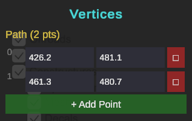

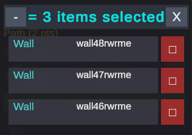

## BuildingE說明

用來在列表中選擇各種建築物的種類，並使用DrawBush按住左鍵拖動來繪製建築物。既可以先選擇建築物的種類後繪製，也可以先繪製然後再選擇建築物的種類，選擇後點擊已經畫好的建築物即可完成替換。

在搜索欄中可搜索對應名稱來快速選擇對象，牆的相關圖鑑表見群文件：一堆表.xlsx。

最上方HeightDown與HeightUp的作用為改變點擊位置的Building高度，每次變化2（6）。

RoofSwitch的作用為將屋頂變為尖頂/平頂，尖頂方向固定需要選擇建築物後按R自行旋轉。

建議先調整完Height後再在上方疊加新的對象，上方的對象高度不會隨下方Building高度的變化而變化。

在用Select選中後，可以在這個界面查看id、當前層、屋頂是否為尖頂、建築物的種類。

Offset的作用是設置自定義偏移度（第一項為X軸向右增長、第二項為Z軸向頂部增長、第三項為Y軸向下增長）。

目前X軸改不了。

> *在飛行模式（透視）下不同方向的透視有嚴重問題，見上方右側例圖，待修復。

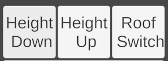

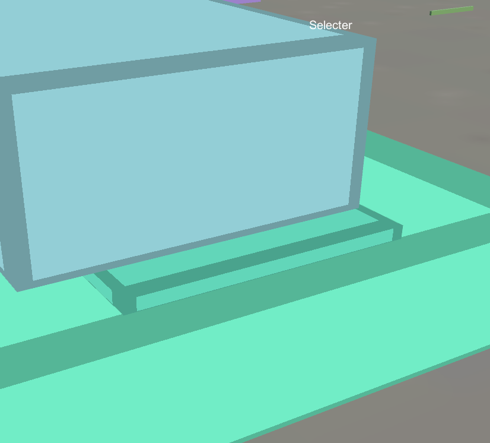

## PlatformE說明

用來在列表中選擇各種平臺的種類，並使用pathBush繪製，與Wall類似，不再贅述。

例子說明見下方：如何畫平臺？

搜索欄與Wall類似，不再贅述。

最下方的TypeChange的作用為讓點擊位置的Platform在無特殊屬性、deck屬性、bridge屬性之間切換，相關圖鑑表見群文件：一堆表.xlsx。（哈哈這個還沒寫完）

ChangeHei的操作為在設置完成高度後按回車進入工具使用狀態，作用為改變點擊位置的Platform高度。

在用Select選中後，可以在這個界面編輯坐標，方法與Wall類似，不再贅述。

在用Select選中後，可以在這個界面查看type、id、當前層、頂部材質、平臺側面牆的種類、平臺上方附加牆的種類、牆的高度。

平臺上方附加牆的種類可以使用WallE工具進行更改。

SetMaterial中添加的值可以是wood、grass、pavement、terrian，相關圖鑑表見群文件：一堆表.xlsx。（哈哈這個還沒寫完）

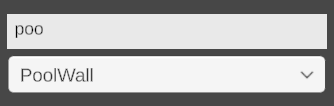

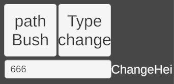

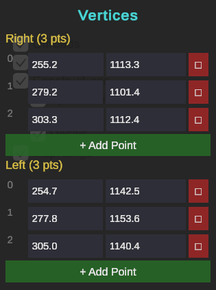

## FuncObjects說明

LadderScatter與LadderEraser的作用為放置梯子與刪除梯子。放置的梯子會自動吸附在旁邊建築物、平臺等等有固定碰撞的東西上。

> *目前吸附堪比哈基米，有點問題，待進一步優化。

ItemSupplyScatter的作用為放置一個儲藏室或軍械庫的判定區，stash為儲藏室，weapon_rack為軍械庫，選中後點擊下方ChangeType進行切換。

CrateScatter與CrateEraser的作用為放置木頭箱子與刪除木頭箱子，裡面的物品隨機無法指定。

SpawnScatter與SpawnEraser的作用為創建復活點與刪除復活點，復活點不宜太靠近地圖邊界。

BaseScatter的作用為左鍵拖動創建據點，在用Select選中後，可以分別更改據點的名字顯示與指定該劇點最開始被哪個陣營佔領，填寫0、1、2，分別為我也不知道對應哪個哈哈XD

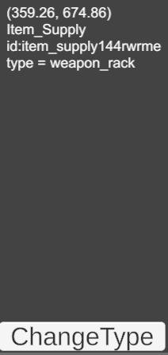

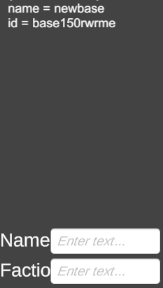

## MeshE說明

用來在列表中選擇各種模型的種類。

搜索欄與Wall類似，不再贅述。

StoneEraser與StoneScatter的作用為刪除一個隨機石頭或放置一個隨機石頭。相關圖鑑表見群文件：一堆表.xlsx。

TreeEraser與TreeScatter的作用為刪除一個隨機樹或放置一個隨機樹。相關圖鑑表見群文件：一堆表.xlsx。

最下方的工具使用方法與Wall類似，作用為放置電線杆子作為節點，放完後按空格進行按順序的兩兩間電線連線，電線僅為裝飾物，無碰撞。

在用Select選中後，可以在這個界面查看id、種類、碰撞體積（如果是默認則不顯示）。

勾選ReCollision後可在上方窗口內更改長、高、寬（以中心為基準）。

offset的作用是設置自定義偏移度（第一項為X軸向右增長、第二項為Z軸向頂部增長、第三項為Y軸向下增長）。

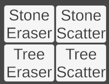

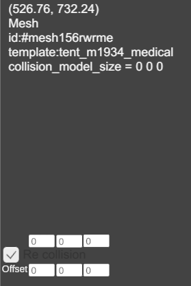

## HeightMap說明

HeightBush的作用為地形刷，左下角界面中的SetHardness為硬度，決定着當前刷取地形的高度與背景高度的過渡陡緩，範圍為0到1、SerRange為地形刷的範圍、SetHeight為地形刷的高度，範圍為0到1。按X橫向鎖定筆刷，按Y縱向鎖定。

HeightSmudge的作用為拖拽鼠標下一定範圍內的高度，並跟隨鼠標移動方向使臨近的地形產生過渡形變。

Smooth的作用為平緩全圖的地形。

Noise的作用為對全圖增加地形上的噪音，讓整個地圖不是同一個高度數值的大平地，有些微小起伏。

heightPath的作用為路徑地形刷，使用方式類似Wall工具，相關數據調整左上角均有說明，可自行嘗試。

## TerrainBash說明

Pathpainter的作用為路徑地面質地刷，使用方式類似Wall工具，相關數據調整左上角均有說明，可自行嘗試。

衰減指數的調成為[與]，並不是描述打重複變成[[/]]了。

painter的作用為地面質地刷，Chg Index為材質種類，填數字，相關圖鑑表見群文件：一堆表.xlsx、Chg Rng為範圍、Chg Har為硬度。

0101版本中使用這個工具的時候左下角可能會有個多餘的調節欄，實際啥用沒有。

Smooth的作用為平緩全圖的地面質地。

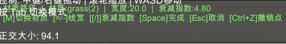

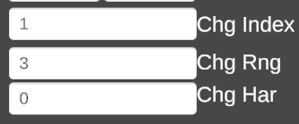

## offroadbuilder說明

用來給AI判定這個路線是開車路線，放飛駕駛。

使用方法類似Wall工具。

## Decal說明

用來在列表中選擇各種貼花的種類，可以理解為在地面質地上再印一層材質，選擇後左鍵即可放置。

deleteDecals的作用為刪除框選範圍內的貼花。

Select選中後，可以使用Length更改這個貼花的大小，也就是縮放比例。

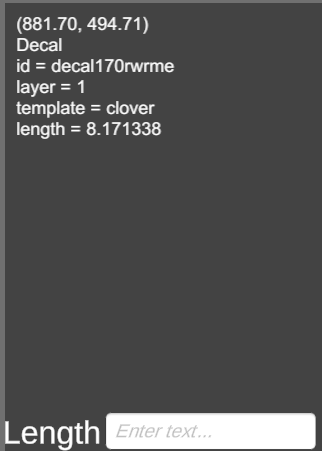

## Assaum說明

用來在列表中選擇各種組件，例如已經製作好碰撞箱和判定區的軍械庫等，選擇後左鍵即可放置。

Add與Name暫時不可用，無效果。

## 一些額外說明

1.如果你想在一個Building上面放Wall、Building、Platform之類的東西，那麼應該在構思完之後從下往上繪製，繪製的時候需要保證起點在上一個元素之內，這樣所有的對象就都會按照layer1、layer2….去逐個疊加，並自動銜接上一個的高度，攀爬等判定也會正常生效。

2.地編在每次保存之後都會重新排序一遍ID，編號可能會發生變動。

## 如何畫平臺？

以過渡的山崖平臺為例：

我們這次的目的是要從左側的高處用緩坡到達谷底的水中，可以看到在箭頭方向的左側是一個不那麼平緩的坡，右側則為陡崖，那我們就應該以左側的坡的高度為基準製作一個過度的山崖。

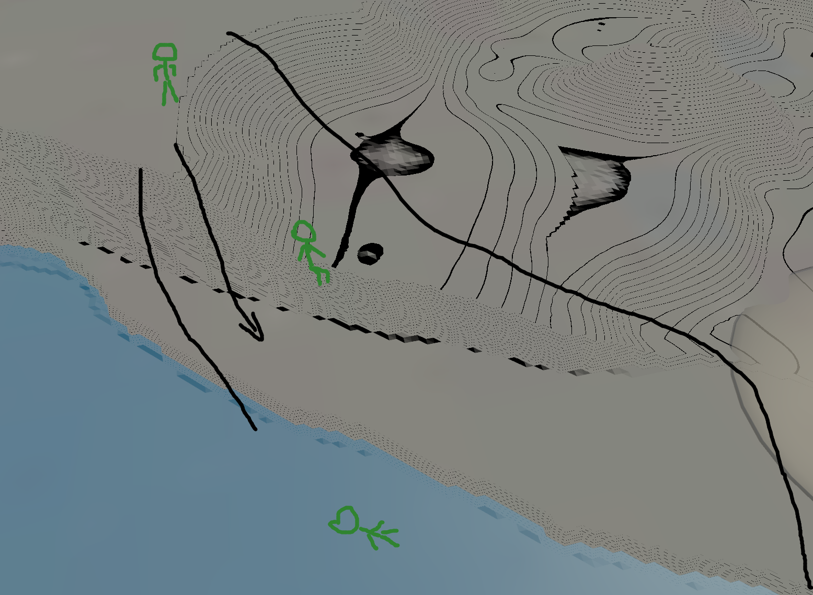

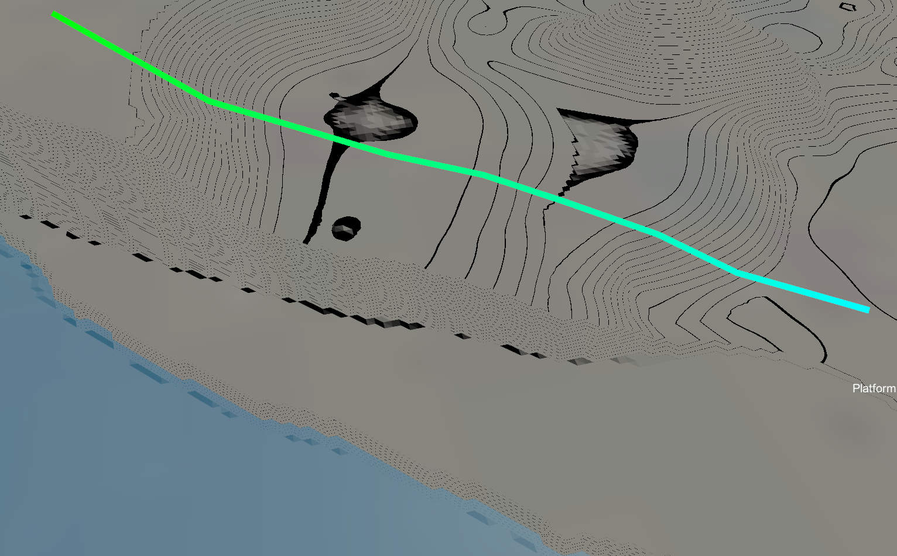

因為繪製平臺時需保證終點邊在起點邊行進方向右邊，同時起點邊為判定高度的邊，所以我們應該先在箭頭的左側緩坡處，沿着圖一的箭頭方向繪製。

（畫了八個點，如果想讓變化更均勻可以多點幾個）

之後按空格，在箭頭右側放置另外對應的八個點，按第二空格次完成繪製。

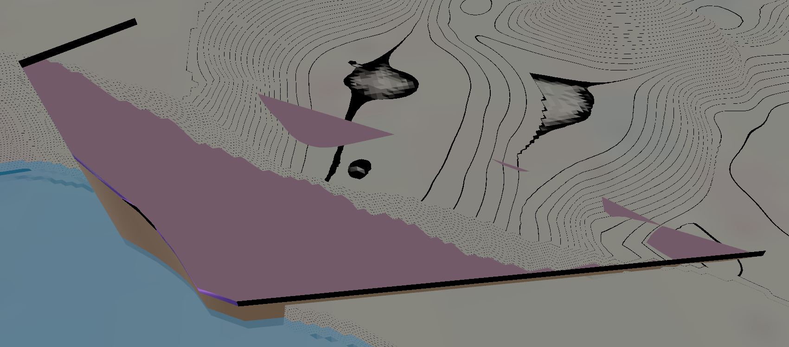

之後對平臺進行細緻調整，使其合理。

（藍色點為基準點，也就是第一次畫線生成的點，藍點到粉點之間的連線就是地形的過渡）

（如果你的平臺是紫黑相間的錯誤渲染顏色，那麼恭喜你你放反了，請再次注意繪製平臺時需保證終點邊在起點邊行進方向右邊）

（反正圖片也沒壓縮，細節自行放大查看吧）

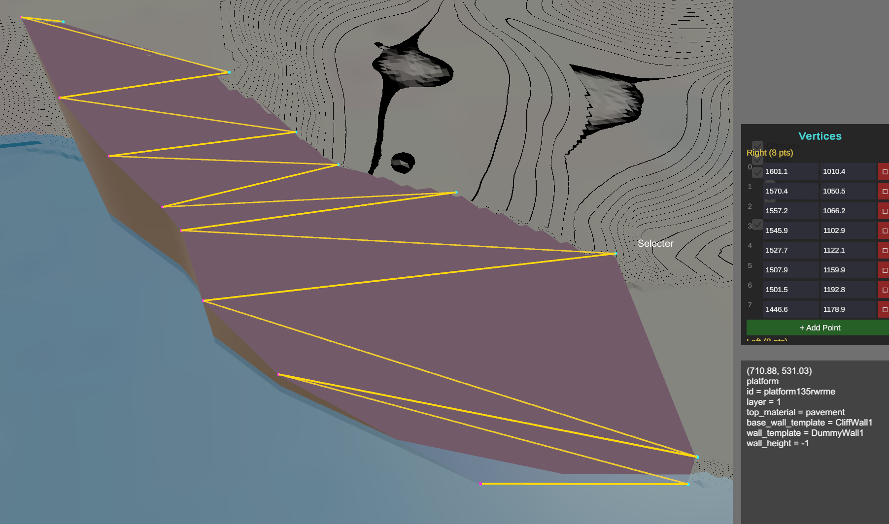

進遊戲看看~

果不其然做的一坨，可見多加幾個錨點和完善地形的重要性，希望各位引以為戒 :(

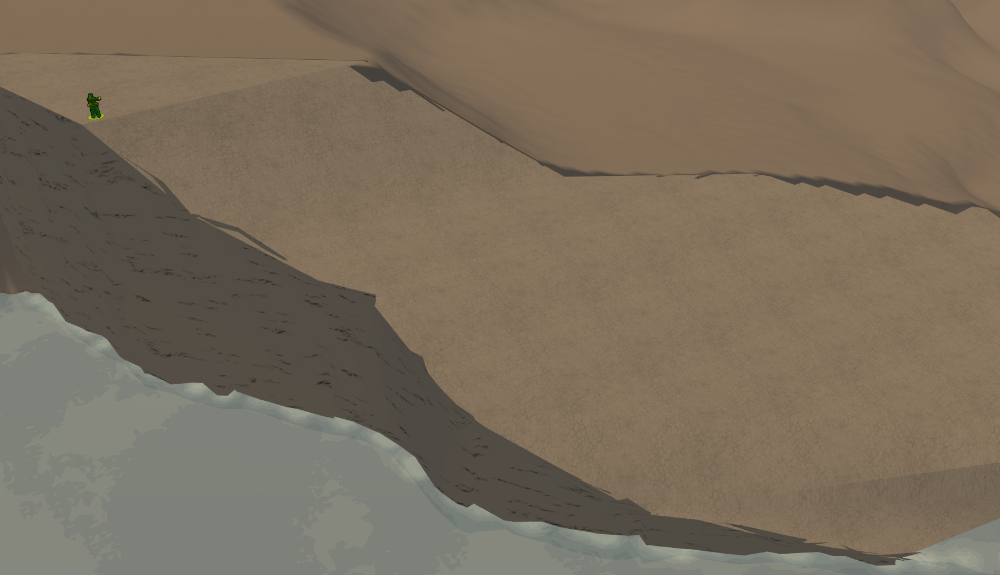
