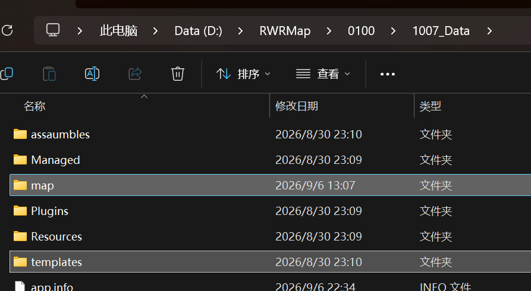
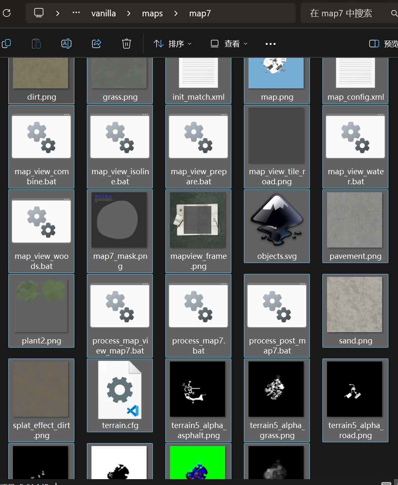
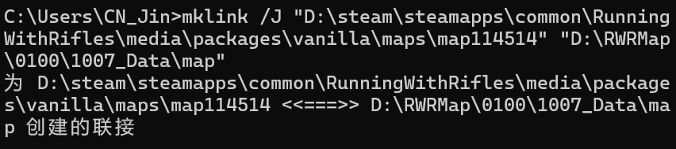
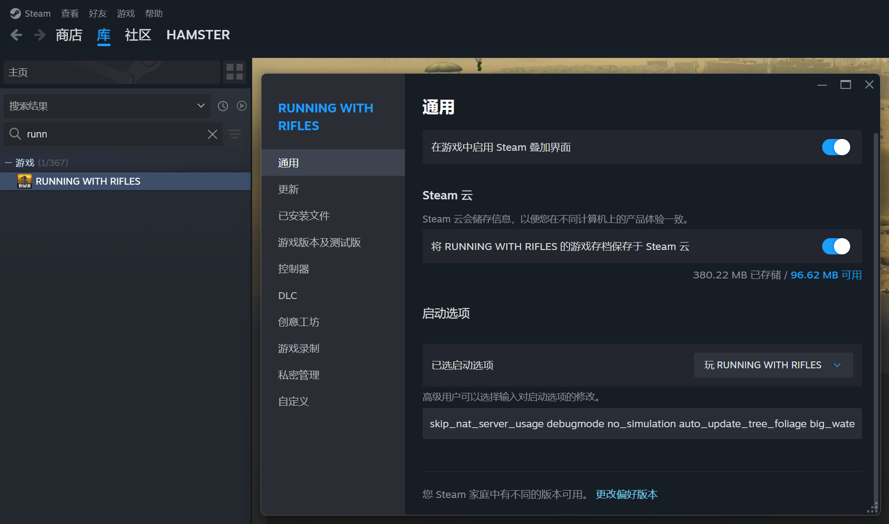
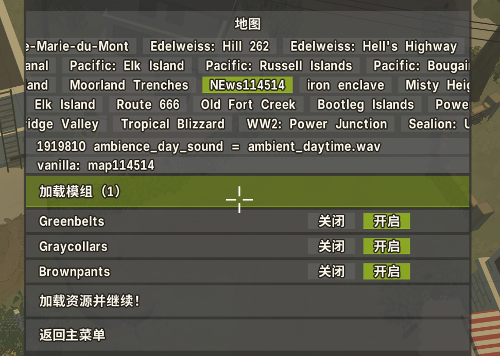
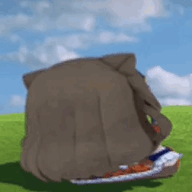

# 準備工作 { #prepare }

<p class="kicker">PREPARE · 裝好，然後才談畫圖</p>

四件事，按順序做完就能開工。前三件不做完，後面每一步都會卡住。

<div class="grid cards" markdown>

-   __1 · 配置地編__

    ---

    解壓，建兩個文件夾，把模板與地圖放進去。

    [:octicons-arrow-right-24: 跳到這一節](#setup)

-   __2 · 同步文件夾__

    ---

    一條 `mklink` 命令，把地編直接接到 RWR 的地圖目錄上。

    [:octicons-arrow-right-24: 跳到這一節](#sync)

-   __3 · 開相機 mod__

    ---

    啟動項裡加一行，遊戲裡就能自由飛、切法線。

    [:octicons-arrow-right-24: 跳到這一節](#camera-mod)

-   __4 · 下 OgreSDK__

    ---

    現在用不上，等 3rdParSettings 要用時再回來。

    [:octicons-arrow-right-24: 跳到這一節](#ogresdk)

</div>

## 一、地編下載後如何配置 { #setup }

1. 將下載後的文件解壓到你自己喜歡的路徑。

    

2. 在 `1007_Data` 中創建一個 `templates` 文件夾與 `map` 文件夾。

    

3. 下載群內的最新模板（目前是 `vao0822.svg`），放進地編的 `templates` 文件夾中。

    

    !!! note "目前只有原版地圖的模板"
        沙漠與雪地的模板暫未製作完成。

4. 選一個你喜歡的地圖放進地編的 `map` 文件夾，**只能選一個**，並且要把那個地圖
   文件夾下所有相關文件都扔進去。拿不準就用 `map7`——它就是上面那份模板的底稿，
   可以避開一些詭異問題。

    

    

    !!! warning "地圖分三類，模板要對得上"
        RWR 原版地圖分為三個類型：原版中的原版、原版中的沙漠、原版中的雪地。
        用哪個類型就要裝對應的模板，而目前**只做了「原版中的原版」這一類**，
        所以只能用 `\vanilla\maps` 裡的文件。

        `map19`、`\vanilla.desert\maps`、`\vanilla.winter\maps` 裡的地圖
        可能會有適配問題——打開看看不影響，但拿它們當底子做就算了。

    ??? quote "上面例圖裡的 .meta 文件"
        例圖裡我地編文件夾中那一堆 `.meta` 用不着管，只是示例。
        把左邊的整個扔進右邊地編文件夾就行。

## 二、如何同步地編與 RWR 的文件夾 { #sync }

地編與遊戲的目錄分開管太麻煩，用一條符號鏈接把它們接在一起。之後在遊戲裡就能
直接玩到自己剛畫的地圖。

1. 按 ++win+r++，輸入 `cmd`，打開命令提示符。

    

    

2. 輸入下面這條命令：

    ```text
    mklink /J "你的小兵步槍要創建的地圖文件夾" "地編的文件夾"
    ```

    !!! note "兩個路徑都要按自己的來"
        每個人的路徑都不一樣，按自己的填。這裡用的是 `\J`——**目錄聯接**，
        不是 `\D` 的軟鏈接；前者不要求管理員權限，跨盤符也沒問題。

        第一個路徑要保證**執行命令之前它不存在**，否則會報「文件已存在」。

    

3. 完成後應該是這樣：

    

## 三、如何開啟 RWR 自帶的相機 mod { #camera-mod }

相機 mod 是遊戲自帶的，只是默認不加載。開起來，進了地圖就能自由飛。

1. 在 Steam 遊戲庫裡右鍵 RWR → 屬性，在**啟動選項**裡填入：

    ```text
    skip_nat_server_usage debugmode no_simulation auto_update_tree_foliage big_water
    ```

    

2. 打開遊戲，點「開始新的快速比賽模式」，然後點「加載模組」。

    

3. 選中 Camera mod。

    

4. 進入地圖，按 ++f4++ 動動鼠標，看看有沒有反應。

    

    | 按鍵 | 作用 |
    | --- | --- |
    | ++f3++ | 開關拍攝宣傳片用的濾鏡 |
    | ++f4++ | 開關自由視角 |
    | ++f5++ | 開關法線模式，用來查看[碰撞箱](#camera-mod "物件的碰撞體積；地編裡靠它判斷能不能站上去、能不能被打到") |
    | ++f6++ | 在凌晨 / 傍晚之間切換 |
    | ++f7++ | 開關 GUI 顯示 |

    !!! tip "F5 是同一個鍵，兩回事"
        在地編裡 ++f5++ 是**刷新界面**，在相機 mod 裡是**開法線模式**。
        取決於你現在在哪個窗口裡。

## OgreSDK 下載 { #ogresdk }

現在用不到，等[3rdParSettings](../settings/third-party.md#third-party)要用的時候再回來。



1. 從群文件下載 `OgreSDK_vc10_v1-7-4.zip`，解壓到自己喜歡的路徑，
   推薦和地編文件夾放在一塊。

    

2. 沒了。之後 3rdParSettings 要用，現在先不說 :)

*[模板]: 物件在 `template = …` 裡引用的名字，地編裡按這個名字找它
*[RWR]: Running With Rifles，小兵步槍
