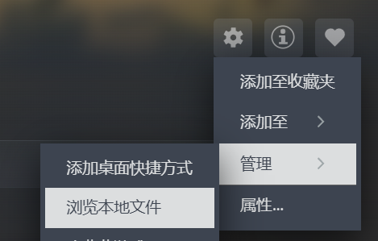

# 3rdParSettings說明（用來加載細緻模型以及部分材質，可不用）

## 一、OgreXMLConverter.exe Path選擇

1.點擊Select，回想一下你把OgreSDK_vc10_v1-7-4.zip解壓到哪了。找到這個路徑的根目錄。

2.按着OgreSDK_vc10_v1-7-4\bin\release找到OgreXMLConverter.exe，選擇它。

3.基礎工作完成，進行二和三。

我的路徑，僅供參考：D:\RWRMap\OgreSDK_vc10_v1-7-4\bin\release

## 二、Mesh files path選擇

1.找到你steam小兵步槍的根目錄，可通過steam界面管理>瀏覽本地文件來定位路徑。

2.按着RunningWithRifles\media\packages\vanilla找到models文件夾，選擇這個文件夾，選擇它。

3.點擊load mesh。

我的路徑，僅供參考：D:\steam\steamapps\common\RunningWithRifles\media\packages\vanilla

效果圖：

Mesh為例

## 三、textures path選擇

1.與二、1.步驟相同

2.按着RunningWithRifles\media\packages\vanilla找到textures文件夾，選擇這個文件夾，選擇它。

3.點擊load textures。

我的路徑，僅供參考：D:\steam\steamapps\common\RunningWithRifles\media\packages\vanilla

效果圖:

Decal為例

