# Building E { #building }

EDITOR · 能放的房子

!!! tip "怎麼讀這張表"
    「預覽」列按兩張圖並排給：左側斜向下視角，右側正對法線。判斷形狀請以**水平線**為準，垂直線是點透視。

    一張表。備註列裡寫着這個房子有什麼毛病。

*[模板]: 物件在 `template = …` 裡引用的名字，地編裡按這個名字找它

| 預覽 | 名稱 | 備註 |
| --- | --- | --- |
| 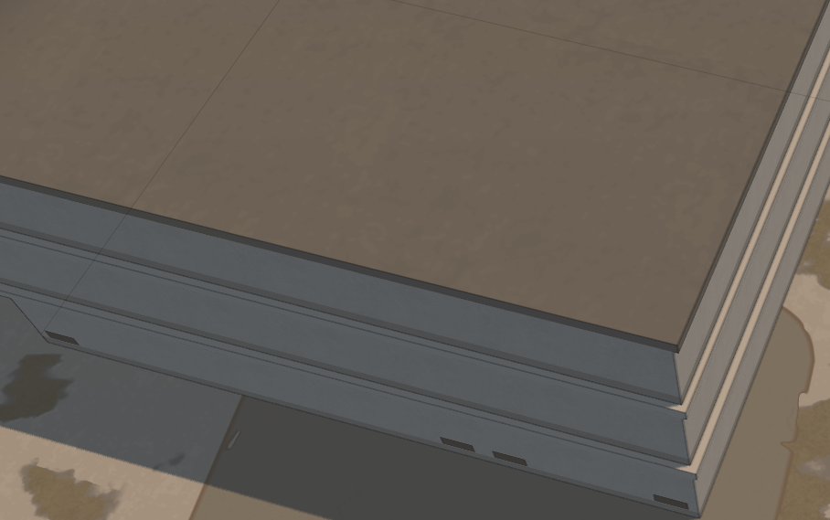 | 乾淨一點的白房子 template = BuildingWhite1 |  |
| 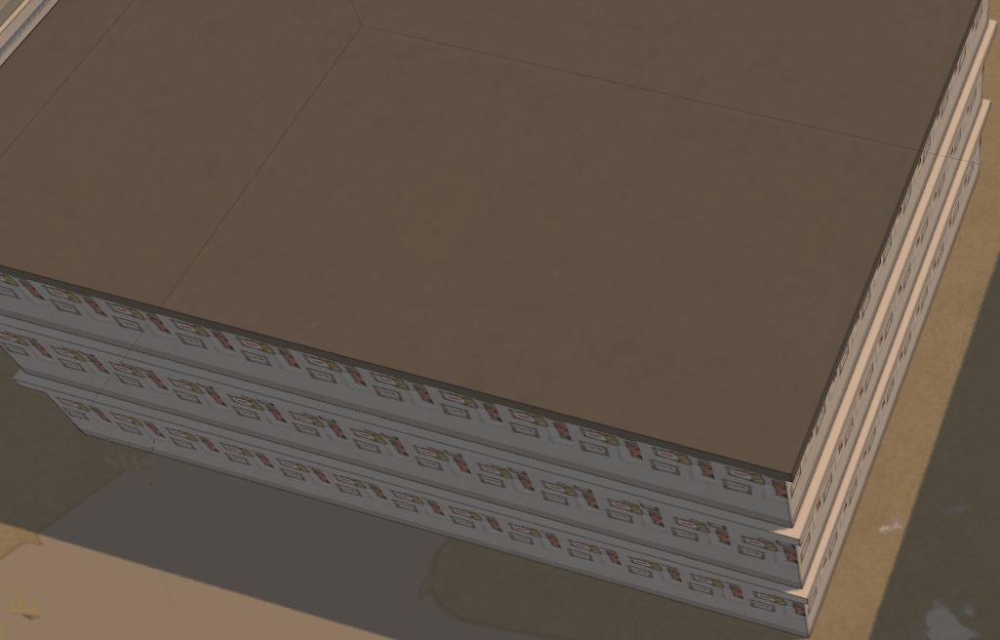 | 貼一堆小廣告的房子 template = BuildingRoofStory1 |  |
| 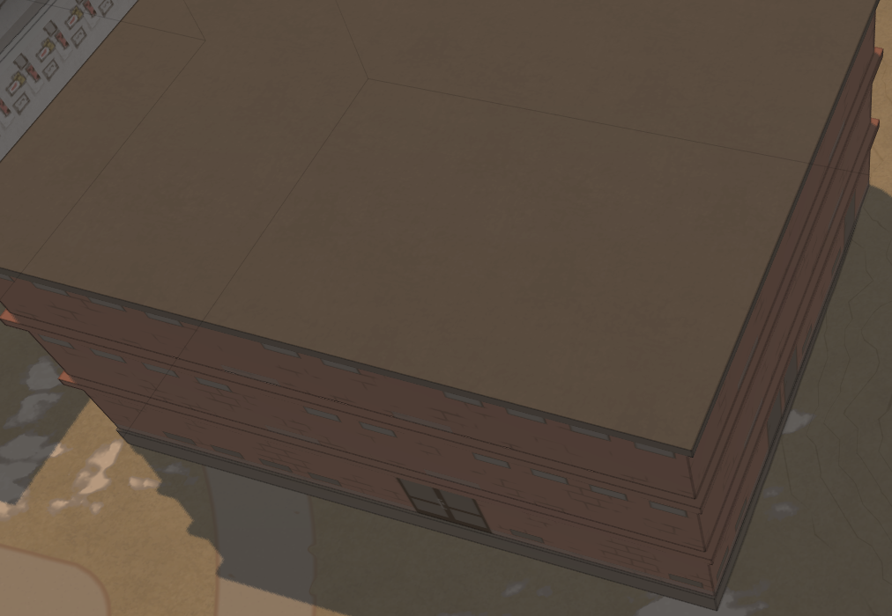 | 磚瓦作坊 template = BuildingFactory1 |  |
| 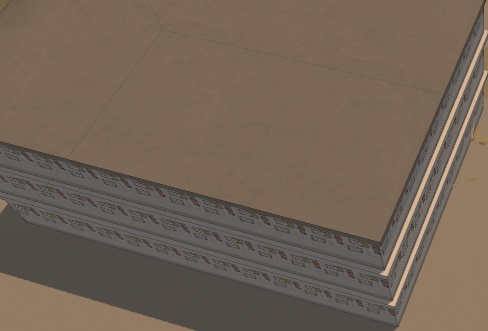 | 貼一堆小廣告的白房子 template = BuildingWhite1RoofStory1 |  |
| 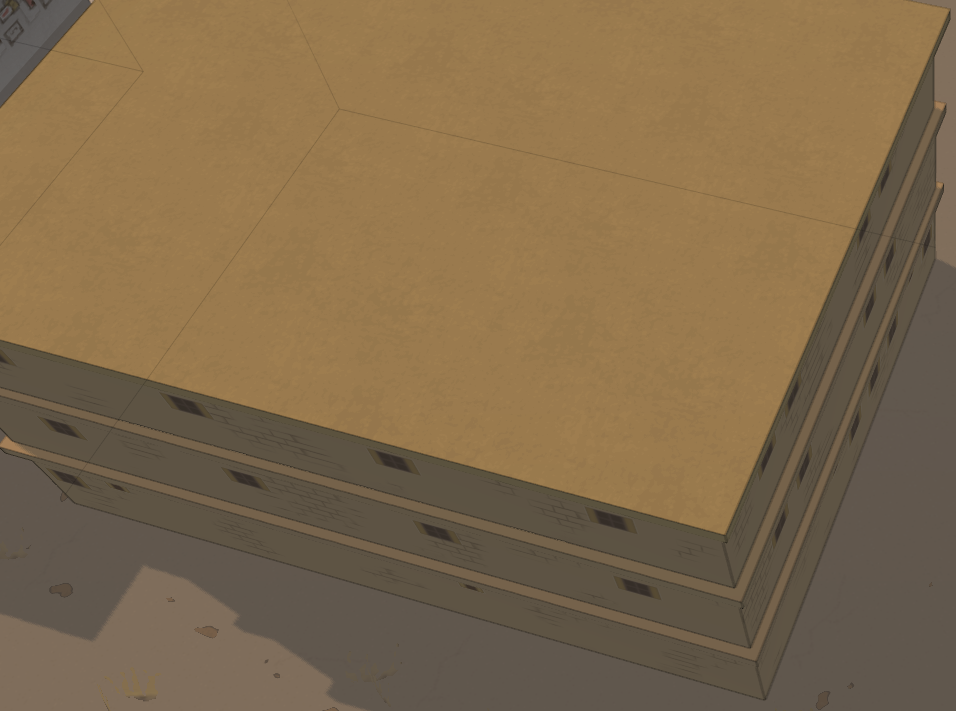 | 沙漠房子 template = BuildingDesert |  |
| 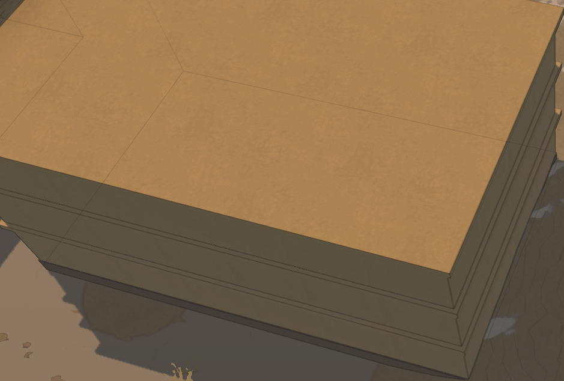 | 不開窗的的沙漠房子 template = BuildingDesertroofstory |  |
| 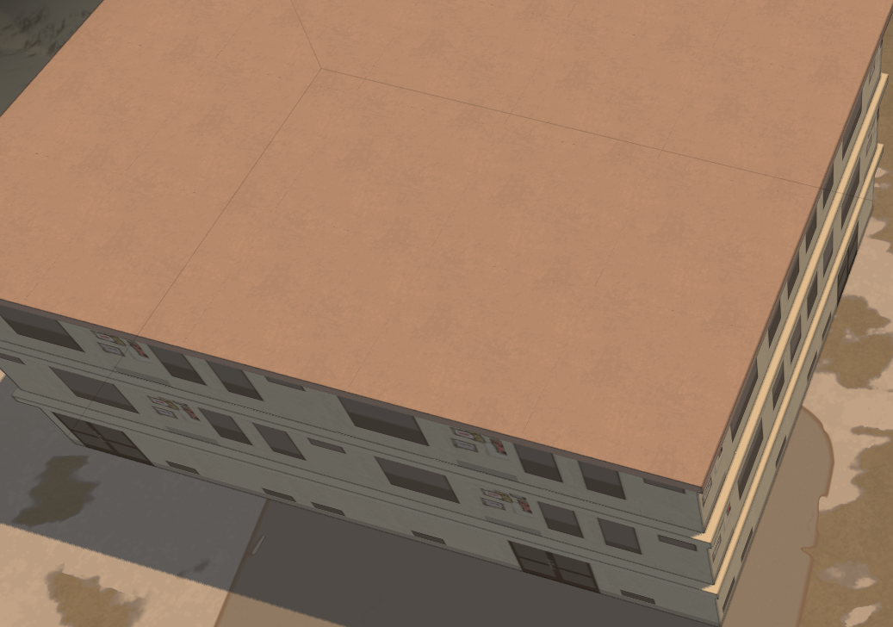 | 大窗戶房子 template = BuildingWhite2 |  |
| 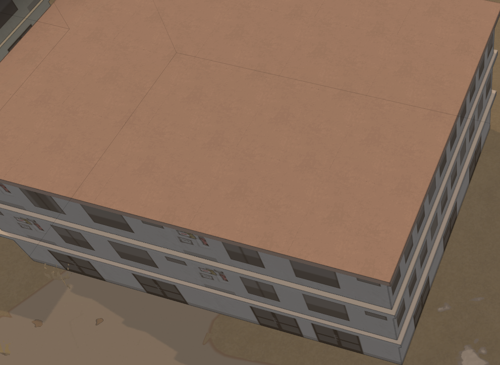 | 窗戶更多點的大窗戶房子 template = BuildingWhite2Busy |  |
| 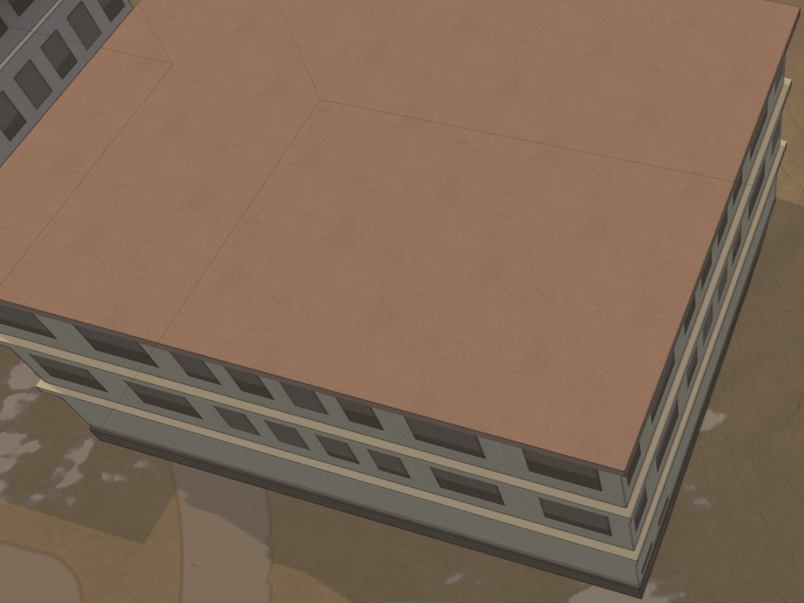 | 窗戶更少點的大窗戶房子 template = BuildingWhite2Empty |  |
| 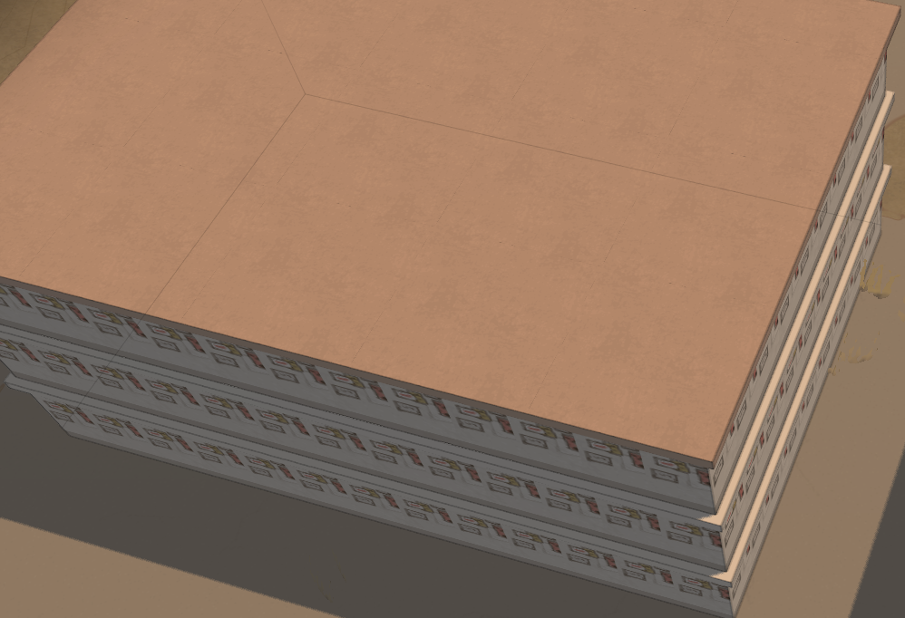 | 貼一堆小廣告的白房子 template = BuildingWhite2RoofStory1 |  |
| 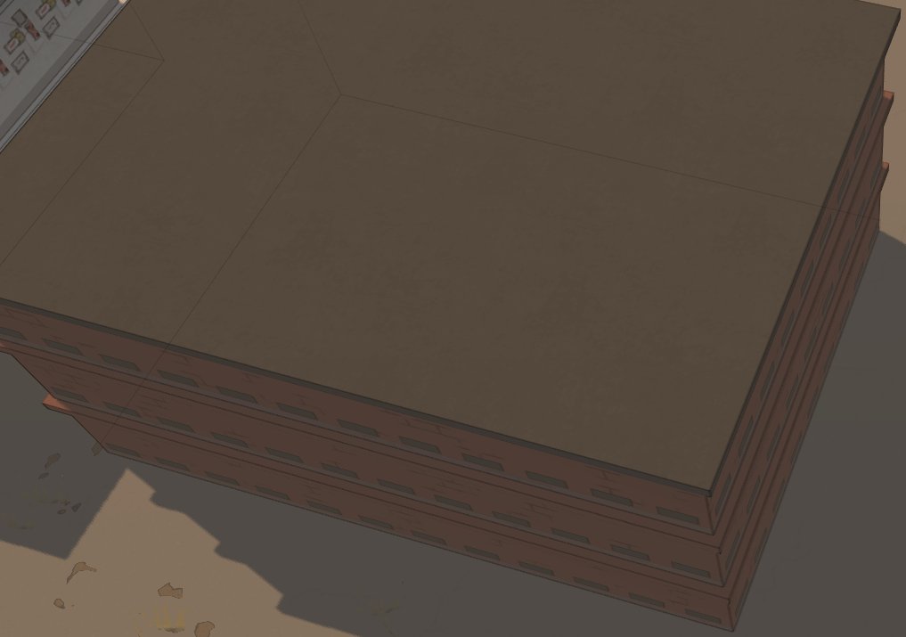 | 窗戶多一點的磚瓦作坊 template = BuildingFactoryRoofStory1 |  |
| 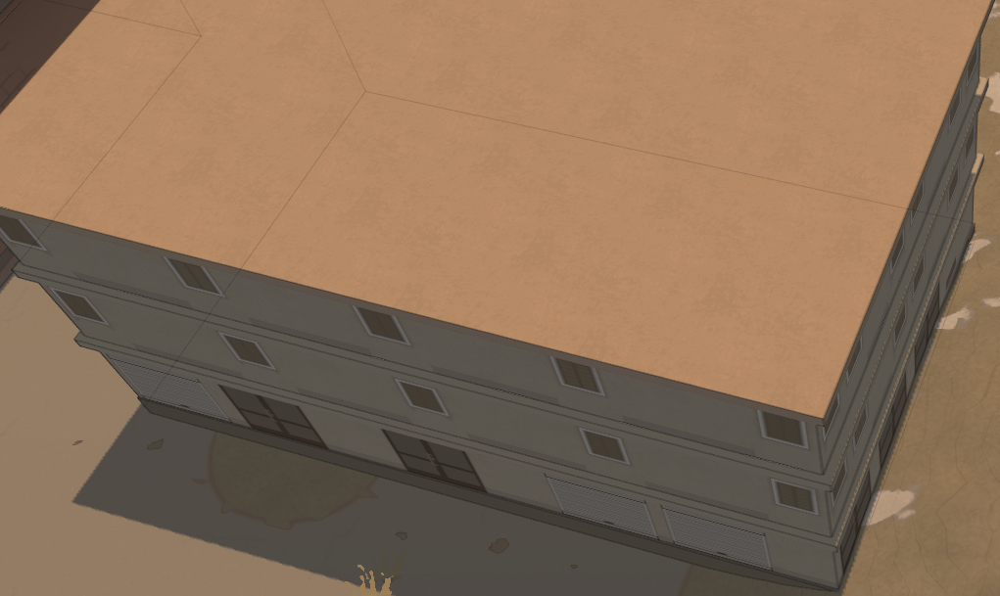 | 帶百葉窗的商店房 template = BuildingShopShutter |  |
